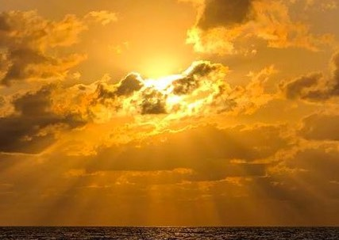
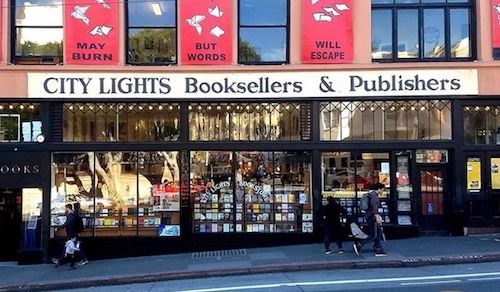
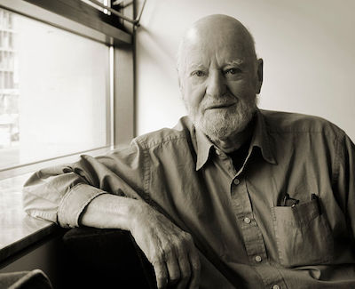
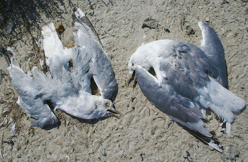

```{r setup, include=FALSE}
knitr::opts_chunk$set(echo = FALSE)
```

When I travel within the United States for short periods, I try to keep my home time. For instance, Denver is two time zones away from my hometown. If I awaken typically at 5:00 am in my hometown, I make sure that I wake up at 3:00 am in Denver. This practice keeps my body clock set so that everything stays copacetic.

In mid-April 1995, I traveled to San Francisco for a professional conference. To maintain my eastern U.S. time zone body schedule, I decided to wake at 2:00 am. Sounds crazy, but it worked. I woke naturally and refreshed before my alarm sounded each day while in California for this conference.

Across the street from my hotel in San Francisco stood an all-night deli. Coffee! At about 3:00 am for every day of my visit, I would walk over and wait in line with the pimps, hookers, crack pipe artists, and the all-night homeless roamers for a cup of pretty good French Roast, walk back to my hotel room, and begin to do some work. Then, a thin gray light would appear, and, soon, rosy-fingered Dawn, the child of the morning and the sister of the Sun and Moon, would stretch over the San Francisco streets. The day-livers began to stir and fill the streets. And, so, to a whole city as stately and plump Buck Mulligan said, *Introibo ad altare Dei*.

{width=50%}

One ritual that I follow when I visit San Francisco is walking across the Golden Gate Bridge early in the morning from wherever I am located in the city. At times, this is a long walk, and I will start before the sun rises. However, I stayed at a hotel near Fisherman's Wharf during my April 1995 visit, so I had a mere few miles of a brisk walk along the shores of the San Francisco bay until I reached the entrance to the footpath across the Golden Gate Bridge. A walk across the Bridge is a great sensual experience.

I always stroll across the bridge, taking the time to take in the ever-new wonders of the view of the Bay area it offers. I have walked in the pelting rain. I have walked in the bone-chilling wind. I have walked when a great San Francisco fog enveloped the bridge and me in isolation. I have walked when the signature fog of San Francisco undulated slowly under the bridge, appearing as a soft, billowing linen sheet newly graced by the orange sun insinuating itself through a morning window. 

And, I always walk across the Bridge to the artsy little town of Sausilito, at which I visit my favorite garden restaurant for a well-deserved feast consisting of a three-egg oyster and onion omelet, sourdough bread toast, and flagons of dark, hot coffee to ward off some of the meaner spirits of the weather that had gathered on the bridge to attempt, without success, to defeat me. Then, it's a fast reach back over the Bay on the jet ferry to Fisherman's Wharf to complete the ritual. *Ad Deum qui laetificat juventutem meam*.

On 19 April 1995, while sitting in my hotel room, I watched a morning news program on my television while the morning sun was casting long early shadows on those San Francisco streets. A news flash appeared: "A bomb ripped through the Alfred P. Murrah Federal Building at 9:02 a.m." Timothy McVeigh, who was later convicted and executed after being found guilty of murder, was arrested 90 minutes after the bombing on a firearms charge after a routine traffic stop near Billings, Oklahoma. But, if I have my figures correct, 168 people died in this bombing. The images flitting across the screen that morning were horrific. Little did we know what more enormous catastrophe awaited us on 11 September 2001.

After watching hours of this devastation in Oklahoma City, I was a bit numb. I decided to get out and walk. And, walk, I did, all the way across town to the City Lights Bookstore, co-founded by poet/painter Lawrence Ferlinghetti and is a landmark independent bookstore and publisher that specializes in world literature, the arts, and progressive politics. 

{width=50%}

Finally designated a city landmark in 2001, the hangout of Beat-era writers -- Allen Ginsberg and Lawrence Ferlinghetti among them-- remains a vital part of San Francisco's literary scene. This is where Allen Ginsberg (1926-1997) first read *How*l, a poem that led to obscenity charges. It begins:

>I saw the best minds of my generation destroyed by madness, starving hysterical naked, dragging themselves through the negro streets at dawn looking for an angry fix, angelheaded hipsters burning for the ancient heavenly connection to the starry dynamo in the machinery of night, who poverty and tatters and hollow-eyed and high sat up smoking in the supernatural darkness of cold-water flats floating across the tops of cities contemplating jazz...

I entered City Lights and found myself drawn quickly to an upper room, the Poetry Room. Although the room is not huge and the stock is limited, it contains some of the best poetry volumes in print on its shelves.

I heard a rustle, and I turned. In a simple office off the Poetry Room, at a simple wooden desk, paging through what looked to be invoices, was Lawrence Ferlinghetti himself. I thought I should pay some homage to the man. Maybe I have a chance to shake his hand and share a word.

{width=50%}

Just then, a loud clump echoed from the stairs. A short, bespectacled, bushy-haired man entered. He strode confidently to Lawrence Ferlinghetti's office door and introduced himself.

"I am Professor *blahdiddyblahblah* [I didn't get it] from Princeton University. You probably know my work," he announced.

Graciously, Ferlinghetti rose and greeted him with a warm handshake, although it seemed visible he had no clue who this puff of hot wind rushing up to him was. Ferlinghetti fielded the man's questions ("So, what is it you are working on now?" "Do you know James *chachacha* [again, I didn't get it]? Of course, he is a close friend of mine.") without any noticeable discomfort. And, in just a minute, it was over. Then, the little professorial gnome of the liberal arts was gone, and all was quiet again in the Poetry Room.

After seeing that display, I could not bring myself to have the audacity to bother Ferlinghetti. So, I settled in a chair and looked for a copy of Tennyson's poems. Now, I like Tennyson, even if he rhymes, and even though I was classified as a "bit gauche" at a Christmas party by an Australian playwright for having expressed this, apparently, politically incorrect and naive assessment. But, like my dog, who has instincts to wag her tail when she sees food or to bark and growl when she senses a threat, I just react to what I see, feel, and hear. And, I like what pleases me. *Mea culpa, mea culpa, mea maxima culpa*.

I looked to my left, where a wooden double-hung window looked from the second story over an enclosed small courtyard. The sun was brilliant at noon. The window framed a clothesline strung at about a 35-degree angle ascending from left to right. On the clothesline were flapping white sheets that cast their shadows on the far courtyard wall, perhaps hung to dry by a maid at the small establishment next door. It was a scene so bright that it hurt the eyes to watch, but a tableau so striking that you might be left with the feeling that it was composed purposefully for an artist to capture in an afternoon on a canvas with paints and brushes.

I started from my reverie at the sense of a presence in the room. I looked back to my right, letting my eyes adjust to the room light. It was Ferlinghetti. He held a white teacup. You could see through the clear rose liquid to the bottom of the cup. He said simply, "For you, while you read," to which I nodded in appreciation but added no voice to my reply. Zen enough.

I walked out of the City Lights Bookstore, across "Jack Kerouac Street," to a bar for a pint of Guinness. I can't remember the bar's name, but it was obviously a homage to the Beat Poets. A bit tacky on that account, but grimy and dark-wooded enough to do the job. An incredible jukebox. The music poured out from the Mills Brothers to Van Morrison to the Rolling Stones to Frank Sinatra to Chopin's Etude in C-Sharp Minor, Op 10, No 4. I read a local paper, then a bit of a novel, and left for the long walk back to my hotel.

It was now mid-afternoon, and the sun was beginning to make its slow journey to its nightly bath in the Pacific. I had a little less spring in my step during the afternoon than in the morning, partly due to the long march I had taken, maybe a bit to the beer, and in no small part due to having the time to reflect on the Oklahoma City disaster.

I came to a small park where there was a wedding party of perhaps 50 people. I felt that the wedding had just occurred in the park because people were standing around kissing the bride and congratulating the groom. I stood and watched. A few of the guests spoke to me, and then the bride and groom came over to say hello to me, perhaps intrigued by sharing their joy with a complete stranger. I wished them well. 

When the Greeks gods sent their earthly charges out on a mission of some import, they plumped and shined them up, oiled their hair, bronzed their skin, toned their muscles, and added a discernible aura. And, so it was with this young couple, beautiful at the start of their journey, eyes wide and welcoming, without a hint of care or danger. Then, after a bit of chatter around the group, someone began singing. Soft at first, then gathering voices, it became music carried on the sweet, warm spring air. *Amazing grace, how sweet the sound/that saved a poor wretch like me/I once was lost, but now I am found/I was blind, but now, I see*. They stepped into their cars and left for a reception.

I walked and walked. Passing all sorts of children and adults, dogs, skittering squirrels in procreative dance in the park, seagulls raiding the trash cans. At last, I ended up near Fisherman's Wharf again. Drumming was heard in the distance.

I moved along the water, passed the more touristy areas of the Wharf, passed the turnaround for one of the runs of San Francisco's famous cable cars, to a small cement amphitheater that overlooked the Bay. Drummers. Everywhere. Drumming.

Big drums. Congas. Snare drums. They were beating out an infectious, driving, multi-layered rhythm. They were old, young, short, tall, male, female, and in-between. There was what appeared to be a transvestite slamming a bass drum. An old, old man in jamaica pants, rubber flip-flop sandals, no shirt, and a straw hat was wailing away on a Fisher-Price red, white, and blue toy xylophone, drowned out by the rest of the din but seemingly highly appreciated for his effort and panache by the other drummers. They were swaying and sweating in a kind of ecstasy probably duplicated only in Congo Square in New Orleans on steamy August nights.

My eyes were drawn to some activity down by the water. Sea birds seemed to be thrashing about. I left the drummers and walked closer to what appeared to be a skirmish. Two seagulls were pecking wildly at another bloodied and torn seagull. I watched for a minute while the two killed the battered bird. They nibbled the dead bird's flesh in a mad cannibalistic frenzy.

It seems as though this was destined to be a day for species to eat their own kind.

{width=50%}


## Last updated on {.appendix}
```{r,echo=FALSE}
Sys.time()
```

## Reuse {.appendix}

Text and figures are licensed under Creative Commons Attribution [CC BY 4.0](https://creativecommons.org/licenses/by-sa/4.0/). Source code is available at <https://github.com/davidpassmore/blog>, unless otherwise noted. The figures that have been reused from other sources do not fall under this license and are recognized by footnoted text: "Figure from ...".

## Comments/Corrections {.appendix}

To make comments about this posting or to suggest changes or corrections, send email to [David Passmore](mailto:dlp@davidpassmore.net), send a direct message on Twitter at [\@DLPPassmore](https://twitter.com/dlppassmore), or send an IMsg or SMS to [dlp\@psu.edu](mailto:dlp@psu.edu){.email}.