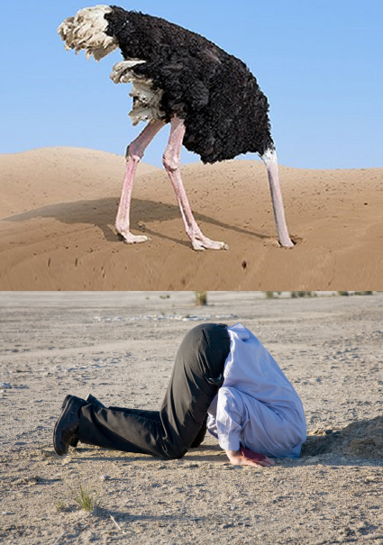

```{r setup, include=FALSE}
knitr::opts_chunk$set(echo = FALSE)
```

Charles Sanders Peirce, “The Fixation of Belief,” *Popular Science Monthly* (12, 1877: 1–
15), characterized "ostrich" beliefs. From the Pierce article:

>I remember once being entreated not to read a certain newspaper lest it might
change my opinion upon freetrade. ‘Lest I might be entrapped by its fallacies and
misstatements,’ was the form of expression. ‘You are not,’ my friend said, ’a special
student of political economy. You might, therefore, easily be deceived by fallacious
arguments upon the subject. You might, then, if you read this paper, be led to
believe in protection. But you admit that freetrade is the true doctrine; and you do
not wish to believe what is not true.’


{width=50%}


Pierce’s statement embeds examples of two types of “epistemic paternalism,” that is, the
restriction of how we come to know things (our epistemology). “First-person
paternalism” involves censoring your own experience and thinking to avoid changing
your deeply held beliefs.

“Third-person paternalism” involves having a third party tell you what to read/do for
your own good. This practice of interfering with people’s efforts at inquiry without their
consent is based because people will be better off without testing, probing, or thinking.

Confronting and engaging arguments with an open mind about what appear, at first
glance, to be stupid conclusions is not as risky as the ostrich might think. On
the contrary, a person can improve by being open-minded.


You treat an argument *openmindedly* only if you are willing to change your mind in
response to that argument based on evidence. Thomas Kelly, in “Following the
Argument Where It Leads,” *Philosophical Studies* (154, 2011: 105–24), suggests
following a “modalized reasonableness,” a disposition to believe, disbelieve, or suspend
judgment on any proposition whenever becomes reasonable to do so.

In Chapter 2 of *On Liberty* -- the locus classicus for a philosophical attack on
censorship -- John Stuart Mill considers a dilemma. On the one hand, perhaps the status
quo opinion is false, and the dissenting opinion is true. In that case, suppressing and
refusing to engage with the dissenting opinion means foregoing an opportunity
to correct ourselves. On the other hand, even if the dissenting opinion is false and is
known to be so, suppressing it robs us of the opportunity to gain, in Mill’s words, “the
clearer perception and livelier impression of truth produced by its collision with error.”

It’s called *learning*; it involves *thinking*; its whetstone is *reasoning*; it requires
intellectual *humility*, not arrogance. Learning, thinking, reasoning, and humility
currently are in short supply, I assert.

Epistemic paternalism is the subject of many academic discussions, much of it wooly.
One article that seems, as its author writes, “clarifactory” is available
at [http://bit.ly/EpistPater](http://bit.ly/EpistPater). Not a late-night read, though.

## Last updated on {.appendix}
```{r,echo=FALSE}
Sys.time()
```

## Reuse {.appendix}

Text and figures are licensed under Creative Commons Attribution [CC BY 4.0](https://creativecommons.org/licenses/by-sa/4.0/). Source code is available at <https://github.com/davidpassmore/blog>, unless otherwise noted. The figures that have been reused from other sources do not fall under this license and are recognized by footnoted text: "Figure from ...".

## Comments/Corrections {.appendix}

To make comments about this posting or to suggest changes or corrections, send email to [David Passmore](mailto:dlp@davidpassmore.net), send a direct message on Twitter at [\@DLPPassmore](https://twitter.com/dlppassmore), or send an IMsg or SMS to [dlp\@psu.edu](mailto:dlp@psu.edu){.email}.