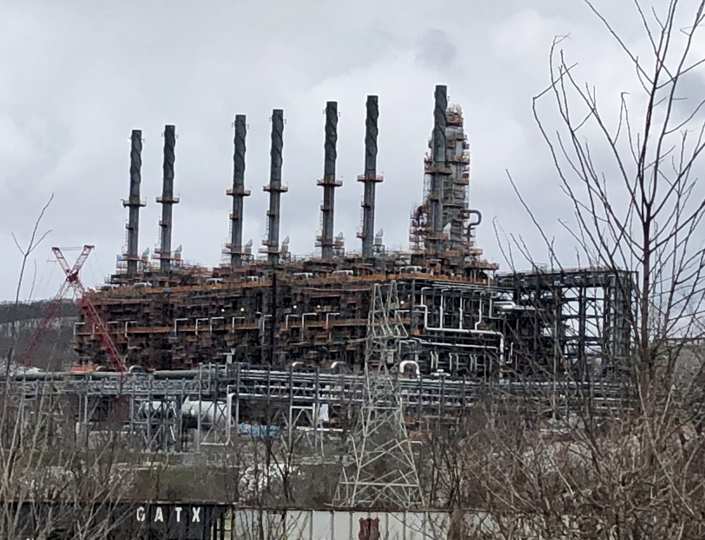

```{r setup, include=FALSE}
knitr::opts_chunk$set(echo = FALSE)
```

I drove to Monaca, Pennsylvania, yesterday to view Shell's ethane cracker. The trip reminded me about a report I wrote in 2012 for a Workforce Investment Board, ["Cracking the Ethane Cracker"](https://bit.ly/Cracker2012). 

I calculated in 2012 a much lower potential impact of the working cracker in Monaca on employment, income, and jobs than did the American Chemical Society, whose evidence was used to gather support and tax relief for the cracker project. Exaggeration of the economic impact of oil/gas/gas liquids activities is evident in many projects (see, e.g., "Penn State studies" of Marcellus Shale development impacts; see my mild griping in the essay, [*Different Numbers in, Different Numbers Out*](https://bit.ly/MarcellusCrit).

Why the exaggeration? I would think that many of these projects have positive impacts that stand on their own. Perhaps these exaggerations of econ impact are meant to divert attention from environmental impacts? The message is "Sure, there are environmental impacts, but look at the jobs, income, and taxes we create."

Any continuing projects to track the various impacts of the cracker? A few are evident:

* [*Health Impact Assessment of the Shell Chemical Appalachia Petrochemical Complex*](https://www.pewtrusts.org/-/media/assets/2019/09/hia-reports/ethane-cracker-in-monaca-hia-report.pdf) \n
* [*Support For Shell Tax Break In Monaca, But Skepticism Over Job Claims*](https://stateimpact.npr.org/pennsylvania/2012/06/20/support-for-shell-tax-break-in-monaca-but-skepticism-over-job-claims/)


