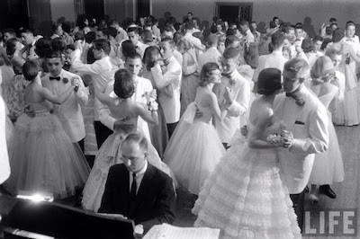

```{r setup, include=FALSE}
knitr::opts_chunk$set(echo = FALSE)
```



## The 7th Grade Dance

| As the pink corsage almost slipped from your wrist 
| Your father was shaking hands with this gangling boy 
| With the cow-licked hair 
| With the ruddy, pocked skin 
| In the starched white shirt ill-fitting at the collar
| Under a circus clown sized suit coat and well-knotted tie 
| Gazing tightly at his just-polished shoes 
| Blissfully taller than you 
| Even with your half-heels on. 
| Your mother smiled and went behind the kitchen door 
| To cry softly 
| While your father waved as you entered the other father's car
| To drive to the 7th grade dance.
|
| There, with your hair stiffened into a 
| Snow carnival sculpture 
| By Selma fire hoses of your mother's hairspray 
| And your suspender-held nylons bagged 
| At your skinny knees but hidden as if by magic 
| By parachutes and gusts of endless white and pink crinoline, 
| You rocked from one foot to the other 
| To match your awkward hero's tentative rhythm, 
| As all around you swayed like Canadian geese landed on a frozen arctic lake 
| From some warm place, 
| With, as the night progressed, your left hand on his
| Shoulder 
| And your right hand in his constant 
| Grasp.
|
| And, Brenda Lee sang: 
| *I'm sorry, so sorry ... That I was such a fool ... I didn't know ... Love could be so cruel ... Oh, oh, oh, oh ... Uh-oh ... Oh, yes.*
|
| Of course, these words meant nothing to you
| Other than the chance to clinch for a few more minutes. 
| Some said that such pathos is wasted on the young 
| That there was still much time for innocence and wonder 
| But it was just practice for the poignant 
| Passion, suffering, and affliction
| That would follow as countless others 
| Eventually turned their backs
| Ground their heels into your soul 
| And left you for love dead.
|
| But, all that was a long journey away from this day.
|
| Just how did you get the nerve to brush his lips with yours 
| With your dad and mom waiting nervously behind the door 
| And his dad smoking with the radio on in the car? 
| How did it feel to gasp with the sense of wonder 
| That this rough boy liked you, yes, you? 
| 
| How did it feel for the first time to long 
| To see someone again? 
| Think. 
| Feel. 
| How long did it last? 
| When was your innocence lost?

## Reuse {.appendix}

Text and figures are licensed under Creative Commons Attribution [CC BY
4.0](https://creativecommons.org/licenses/by-sa/4.0/). Source code is
available at <https://github.com/davidpassmore/blog>, unless otherwise
noted. The figures that have been reused from other sources don't fall
under this license and can be recognized by a note in their caption:
"Figure from ...".

## Comments/Corrections {.appendix}

To make comments about this posting or to suggest changes or
corrections, send email to [David Passmore](dlp@davidpassmore.net), send
a direct message on Twitter @DLPPassmore, or send an IMsg or SMS to
[dlp\@psu.edu](mailto:dlp@psu.edu){.email}.
