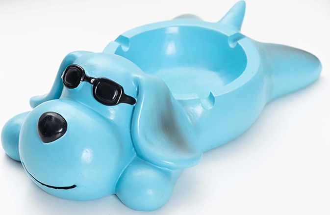
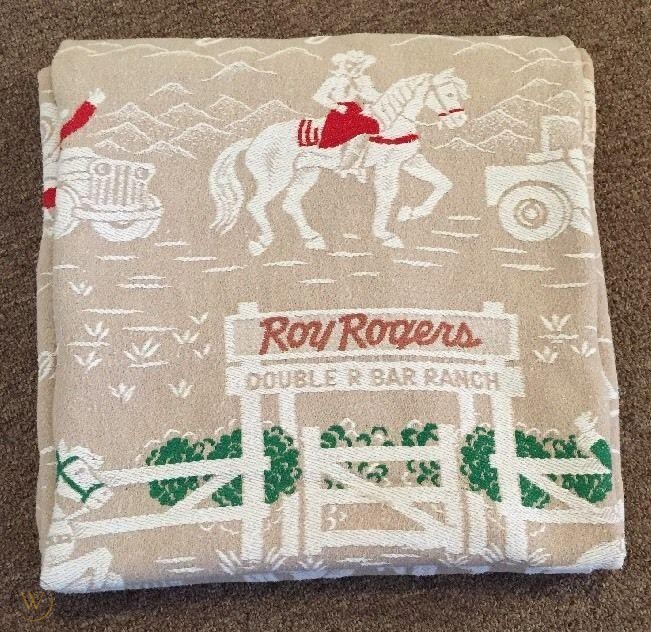

```{r setup, include=FALSE}
knitr::opts_chunk$set(echo = FALSE)
```

When I was about eight years old, my parents took me to the Erie County Fair in Hamburg, New York. Lots of farm equipment, farm animals, and a midway. I won this ashtray by landing a pingpong ball in a fish bowl:


I could have had the live fish, but I took the cheap ceramic dog on the edge of the ashtray, instead.
This little blue dog with the sad eyes sat on my dresser for years. He held bits of pencils, knives, chewing gum, and later, as you can see from the burn marks, cones of incense. He was dusted once or twice over the years, The yellow discoloration on him is from my parents 2 packs-a-day (each) smoking.

This little dog is a figure in one of the most meaningful dreams of my life.


When I was a junior in high school, my father came home from work one day via the emergency room. A large steel plate, the size of a piece of standard plywood sheeting, had grazed the front of his body. He had cuts on his face and bruises all down his body where the plate had fallen forward and scraped him. Luckily he wasn't underneath the plate.

My father worked hard. He had been a personnel and safety director of his battery manufacturing plant, but, when the firm was purchased by an automobile manufacturer, many men were released from work. He was fortunate to be rehired in the place he had started years before--as a laborer.

He plowed snow. He shoveled keystone (very fine grain coal), sometimes for an entire day, guiding the gritty black stuff from a rail car into a silo. He would return home exhausted. Coal black. In need of a single shot of Black Velvet, some dinner, and some sleep. I don't think he ever made over $10,000 per year, even though he amassed a huge amount of overtime.

Funny, although he had been a member of the management, he was rehired to work side by side with many of the people he originally had hired and supervised. Then, he became president of the union. Eventually he served on the state workers compensation board, where I first learned from perusing his meeting minutes, what an arm, leg, eye, or life was worth in compensatory terms.

Well, the steel plate accident was the straw the broke the camel's back. His health began to deteriorate. It became difficult for him to walk. He seemed disoriented. Clearly, something was wrong. He filed for a disability retirement when he was 55 years old.

That was not an easy time. His company, for which he had worked for 38 years, denied his disability retirement claim and tried to blame his current difficulties on a war time injury. He had broken his femur while jumping on an Army truck. We were without money of any sort coming in. The government denied that he had a claim against them. His company refused to budge. My parents used the last of their savings. They sold their war bonds. They cashed in their life insurance. I never really saw my mother cry before so bitterly. My father was very sad.

As a teenager, you don't know what to make of the world around you crumbling. Moreover, you don't know what to say. You just watch. Quietly. Keep your thoughts to yourself. Indignity after indignity experienced by people who always paid their way, but , now, were without resources. My uncle brought us food. I wondered, where were those people to whom my father took clothes and food when he was a member of the St. Vincent De Paul Society? Where were the nuns and priests of the church which he had served for years and for whom I had been a faithful alter boy since I was 10 years old? We certainly needed them, but I suppose it would have been even more humiliating to have had their help. No, tough it out alone. Ask for no help.

The next year, I did not go out for the football team, even though it was my senior year. Let's face it, I wasn't very good. But, I preferred to be alone. I threw the shotput and discuss, solitary events which leave a lot of time for thinking.

I did not apply for enrollment in any college. I started working as a truck driver the Monday after my high school graduation. I found a job at a Kimberly Clark paper mill. I felt an obligation to be the bread winner.

After about one-half year, our money situation stabilized. My father received social security disability payments, and so did I as his son. He was awarded a disability pension. When the chance to go to school arrived, I took it, with my parents blessings and encouragement. I am sure it was a financial hardship. In the sprint from by undergraduate degree to my PhD, I only took one summer off to work at a hospital. I felt as though I never would get such a chance again.

My father was ill, sometimes very ill. His ability to walk continued to deteriorate. He was in and out of the hospital. Pneumonia. All sorts of complications of not being able to move well. The onset of diabetes added to it. He required constant care, which my mother gave without a whimper. We could not afford a wheelchair, so my mother would drag a rug with my father on a plain kitchen chair to move him around the house. It was, I am sure, exhausting.

In the summer of 1969, poised between the last course for my baccalaureate degree and a move from Niagara Falls, New York, to Bowling Green, Ohio, to start my masters degree, I was very anxious. No one told me not to go, but I felt very guilty leaving my mother and father alone to fend for themselves. When my father needed to be lifted, moved, shaved, and the like, I did it. I was leaving my home for good. What would they do? No one said a word about all this, but it festered in my conscience like an ugly, infected boil.

Then, one night in the summer of 1969, I had a vivid dream, one whose colors, smells, sounds, and temperature I can sense to this day.

In this dream I spoke to my parents in our kitchen, and, then, ascended our stairs to a second floor that was musty because all we did was store old things in the two bedrooms about our little box house first floor. Amazingly, there was another door--we did not have a third floor, but there it was, a door. I walked through the door and up the steps it opened to.

As I reached the top of the stairs, I was high above the city on a rectangular platform. Above was a black, coal black, sky with a thousand vivid points of light. Stars, some white hot, others red, green, and blue. The air was cool and comfortable.

I turned to see my parents standing behind me smiling in a way that I had not seen in many years. They seems satisfied, happy, and expectant, although they did not utter a word.

They led me to a corner of this open roof. There, inside a doorway, was a room. A room I had not seen for many years.

It was the room I had when I was eight years old.



In the center of the room was my old twin bed, cheap wooden headboard and footboard painted in a pastel gloss. On the bed was a worn, fuzzy bedspread. Embroidered on the bedspread was a picture of Roy Rogers and his horse, Trigger. There, in embroidered script below their likenesses, was Roy Rogers Double R Bar Ranch! " This was the bedspread on which for years I had bounced, assembled my toys, read my books, stared at the ceiling waiting for sleep.

A small lamp was lit to cast a low, orange glow over the area. My dresser was to the left of the bed. On the dresser was an airplane I had assembled from a kit.

I moved to the side of the bed to see the dresser better. On the corner of the top of the dresser was my little blue ceramic dog cradling his bits of pencils, knives, and chewing gum, just as I remembered him. The little blue dog had been in my room really all those years, but he had receded into the background under shirts, clothes, and the detritus accumulated by a young person. But, here he was in my dream, fresh as the day I first put him to work to hold my favorite possessions.

I turned 180 degrees to see my parents looking at me with simple, reassuring smiles. They were close, holding hands, one arm of each around the other. The look they had showed complete love and acceptance. A look of happy, anticipation was on their faces. It is shocking how palpable this image seems to me now.

My father gestured toward to bedroom. Even though he said nothing, I felt as though he was offering it to me. As a place of refuge, as a place of love and acceptance, as home.

The warmth of his gesture and the looks on their faces said I could have this place forever, that I could be safe and secure, that I could be loved. All I had to do was to ask.

I said to them, "No, thank you."

They both smiled. My mother said, "Yes, we figured so." "Now, go ahead." she said softly and kindly and with a smile.

As though dragged by a wind down a tunnel, I woke instantly. I snapped upright in my bed. I was confused about my location for a bit. I listened, but all I could hear was the song of tree frogs calling in the night.

It was 4:00 am. I left my bed, walked to the front porch, and stared at the horizon until the sun came up.

It was amazing, but a burden was lifted from me. I felt, what I should have known already, that my parents wanted the best for my future, even if it the burden lifted from me would add to their burden.

And this is the way it is. Parents sacrifice for their children. Many times, the children never recognize what great love parents have for them and what huge sacrifices the parents make for them. Many times, the parents never realize the esteem with which their children hold them. But, gratitude is not something that factors into pure, unconditional love, is it?

So, in the end, my dream taught me that my parents wanted my success, not my dependency. The dream summarized and crystallized what I knew in my heart.

My little blue dog was there in life and in my dream. He had been sitting, with those big puppy eyes, in a dark corner of my family room waiting for me. I buffed him up, and brought him to my office, where he was enshrined until I retired.


## Last updated on {.appendix}
```{r,echo=FALSE}
Sys.time()
```

## Reuse {.appendix}

Text and figures are licensed under Creative Commons Attribution [CC BY 4.0](https://creativecommons.org/licenses/by-sa/4.0/). Source code is available at https://github.com/davidpassmore/blog, unless otherwise noted. The figures that have been reused from other sources don't fall under this license and can be recognized by a note in their caption: "Figure from ...".

## Comments/Corrections {.appendix}

To make comments about this posting or to suggest changes or corrections, send email to [David Passmore](dlp@davidpassmore.net), send a direct message on Twitter @DLPPassmore, or send an IMsg or SMS to dlp@psu.edu.
