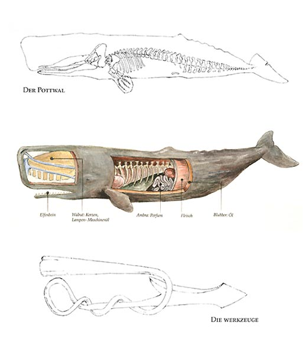

```{r setup, include=FALSE}
knitr::opts_chunk$set(echo = FALSE)
```

A young friend held up a paperback copy of *Moby-Dick*, Herman Melville's epic allegorical novel about the voyage of the whaling ship, the *Pequod*, the ship's variegated crew, and its tyrannical Captain Ahab and their pursuit of the great, ferocious white sperm whale, Moby Dick. Captain Ahab drives his harpooners and mates to kill Moby Dick, to whom Ahab had lost a leg in an earlier encounter. 

{width=50% }

Starbuck, the thought-filled first mate of the Pequod, and other members of his crew -- Stubb and Flask, most notably -- are joined by the "savage cannibal," Queequeg, and other harpooners -- a native American, Tashtego, a giant African, Daggoo, and the sinister Persian, Fedallah -- join to fulfill Ahab's single-minded, obsessive desire to destroy the Great White. Moby-Dick begins with its fictional narrator's famous line, "Call me Ishmael," perhaps one of the most famous openings in American literature.

My young friend's paperback volume did not seem quite thick enough for the original. Melville's book is a long work that often is abridged for young and modern readers. In its virgin form, *Moby-Dick* is peppered with what seem now to be odd sailing terms and references to the sensibilities of 1850s seafaring, making the manuscript certainly challenging slogging for most of the dot.com generation and for anyone accustomed to maintaining any more than the one-hour-and-out attention span required to watch a History Channel treatment of a topic. No, the actual *Moby-Dick* is difficult for most young readers even to carry, let alone read.

Melville had extensive experience at sea. He served as a cabin boy, as a seaman on the frigate *United States*, as a harpooner out of Nantucket, Massachusetts, and as a member of the crew on a whaling ship, *Acushnet*, in the South Seas from which he reported jumped ship and lived among native people for three years. Yet, with all the fog and foam conjured on its pages, *Moby-Dick* was written in land-locked western Massachusetts from Melville's knowledge and experience with the sea and whaling.

As he wrote *Moby-Dick*, I feel sure Melville had to create scenes, dialog, and a flow as though the whole story was played out in front of him. In the green hills around Pittsford, Massachusetts, the only water of significance would result from drops on the trees and through the little dales in cool emergent spring, during languid summer afternoons, and on magnificent, dappled fall's canvass of spent life waiting for the first frost. So far from the vast green sea, without the rolling dark waves, without the briny smell of boiling seawater pressed outward by the prow of the ship, Melville wrote such passages as in Chapter 51, *The Spirit-Spout*,

>It was while gliding through these latter waters that one serene and moonlight night, when all the waves rolled by like scrolls of silver; and, by their soft, suffusing seethings, made what seemed a silvery silence, not a solitude: on such a silent night a silvery jet was seen far in advance of the white bubbles at the bow. Lit up by the moon, it looked celestial; seemed some plumed and glittering god uprising from the sea.

Or, as in Chapter 111, *The Pacific*,

>There is, one knows not what sweet mystery about this sea, whose gently awful stirrings seem to speak of some hidden soul beneath; like those fabled undulations of the Ephesian sod over the buried Evangelist St. John. And meet it is, that over these sea-pastures, wide-rolling watery prairies and Potter's Fields of all four continents, the waves should rise and fall, and ebb and flow unceasingly; for here, millions of mixed shades and shadows, drowned dreams, somnambulisms, reveries; all that we call lives and souls, lie dreaming, dreaming, still; tossing like slumberers in their beds; the ever-rolling waves but made so by their restlessness.

Or, in Chapter 132, *The Symphony*,

>It was a clear steel-blue day. The firmaments of air and sea were hardly separable in that all-pervading azure; only, the pensive air was transparently pure and soft, with a woman's look, and the robust and man-like sea heaved with long, strong, lingering swells, as Samson's chest in his sleep.

If you can read these passages without hearing the sign-song creak of the mast, without smelling the new and old life and death in the sea parted by the ship, without feeling in the palm of your tar-stained hand the snag of a sliver from the deck rail, or without seeing in your long gaze the gentle curve of the horizon melding with the infinite, without rocking to the pitch and yaw of the ship as it charges in a wild reach, then you just might not be concentrating.



Perhaps the secret to penetrating what seems to us as turgid prose from a long-gone era is to actually make *Moby-Dick* with Melville, not merely read it. Although Melville put down his pen as he finished writing his signature work almost 160 years ago, Moby-Dick is new to us and occurs again as we read it...every time we read it. This is the magic and sacredness of books that no film could ever hope to match, no matter what budget or artistry is behind it. Every time we read and re-read a book, the story is told with fresh, new meaning because the story is not a story with meaning to us until we imagine and fill in the cracks with our own thoughts, colors, smells, and textures. In this way, no one reads *Moby-Dick* in the same way as any other person. In fact, like some sort of Alzheimer's patients, we read a book differently every time we encounter it.

So, my advice, my dear young friend: read *Moby-Dick* without worrying about finishing it, no matter what your teacher requires. Buy the unabridged version. Savor the words. Build the story in your mind's eye. Enjoy the poetry of it all. For one day, you will have a Great White of your own to slay, when the deep moans 'round with many voices, when you will need already to have had practice with the reckless pursuit of demons without a thought for your own peril.


## Last updated on {.appendix}
```{r,echo=FALSE}
Sys.time()
```

## Reuse {.appendix}

Text and figures are licensed under Creative Commons Attribution [CC BY 4.0](https://creativecommons.org/licenses/by-sa/4.0/). Source code is available at https://github.com/davidpassmore/blog, unless otherwise noted. The figures that have been reused from other sources don't fall under this license and can be recognized by a note in their caption: "Figure from ...".

## Comments/Corrections {.appendix}

To make comments about this posting or to suggest changes or corrections, send email to [David Passmore](dlp@davidpassmore.net), send a direct message on Twitter @DLPPassmore, or send an IMsg or SMS to dlp@psu.edu.