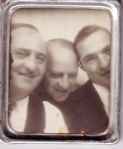

```{r setup, include=FALSE}
knitr::opts_chunk$set(echo = FALSE)
```

| {width=25%, height=50%} |
| *The Passmore bros: Kenneth (my father), Allen, Tom (l to r) *

***

>Every man's memory is his private literature.
  ~Aldous Huxley

>We do not remember days; we remember moments.
   ~ Cesare Pavese, *The Burning Brand*

Each of my memories has a little heat. In moments of icy sweetness or during very early mornings when I am the only one stirring as silence blankets my room, these memories float before me, waiting to be plucked from the air and studied as a paleontologist might examine clinically a fossil or as an one who appreciates fine art might scan brush strokes or color for insight into an artist's process, thoughts, technique, and motivations. I have a veritable museum of memories similar to Andy Warhol objects in his installation, *Floating Plastic Inevitable*.

By strange coincidence, this morning, hot air balloons actually drifted across Houserville, a little community outside of State College, Pennsylvania, my home town. Such is the landscape of my memories that is crowded with Jackson Pollock splotches of silver, red, and gold as well as the ragtag detritus of my life. After 57 years,^[Wow, 17 years ago from the date I reprised this on my current blog] a man can accumulate an air controller's nightmare of memory traffic containing events, feelings, smells, and textures, some as clear as high mountain air and others weathered and scratched as old photographs in the family history trunk. When the rest of my life is on low flame, these memories ascend and move across my valley.

Snatch one from the air. What do I see?

Kenneth, my father -- oddly to many, I always affectionately called him "Father," not "Dad" -- was a quiet and gentle man who grew up in Pennsylvania and migrated to Niagara Falls, New York, to find work during the Great Depression in the United States. He married my mom, Clara, and they remained in Niagara Falls. My parents were approximately 37 years old when I was born, making them mostly much older than the parents of my contemporaries. I am their only child. They both are dead now and are in my thoughts often.

My father was the biggest person in my life, larger than anyone else I ever met. As an only child who was a bit sickly when young, my father was my close friend. I used to get up to eat breakfast with him in the morning, wave to him as he drove out of the garage at 6:50 each morning, and wait expectantly for him to come home at 5:00 pm. 

I thought he was the strongest and greatest man who lived, by which all others were to be judged. When he told me that he had worked on a local bridge project when he first came to Niagara Falls, I believed and told others that he himself built the bridge. I imagined that he ran the company he worked for. 

I thought we were rich, although, in fact, he never made over $10,000 in any year. When he planned to vote for Eisenhower, I liked Ike. When he had an opinion, I valued it above all others. If he had a fact, the truth of the fact was unassailable. If he made a promise, it was as good as done.

My father worked for [Autolite Battery](https://en.wikipedia.org/wiki/Autolite), and was the personnel director in charge of all non-salaried workers. This position meant that he would attend all funerals as a representative of the company. Many times we would go directly to the home of a widow directly after she had learned of a death. He would quietly help with arrangements and offer support. Unobtrusive. Effective. 

He took me to funerals homes where workers who died would be "laid out." Once, we arrived to a funeral home before anyone had showed up. No one, not even the funeral director was in the room. As we stood next to the casket he told me. "Go ahead, touch him." I was horrified at the thought of touching a dead body. But, he said, "He is dead. He won't hurt you. None of us get out of this world alive." He held the dead man's hand in his own and told me about him. I gathered my courage, and grabbed the deceased's hand, too. Cold and immobile, frightening at first, and, then, strangely easy to hold as my father spoke calmly and softly to me about the man's life. 

We took chairs along the wall. People started to enter the funeral home. The dead man's wife arrived. My father walked over to her as she stood in front of the casket. He always kept a spare, clean handkerchief available, as did most gentlemen of the day. When the widow saw my father, she walked over to him and nestled her head on his chest and began to cry. Not just tears, but the tears of a woman lost. Deep grief-filled sobs. He took out his handkerchief, gave it to her. I watch closely to make sure I was taking all of this instruction in. He spoke to her in low tones, acknowledging her grief.

I saw this happen at least a dozen times. I absorbed every nuance -- the tilt of his head, the tone and volume of his voice, the way he focused on the person in front of him. My father was the one who understood, the one from whom you could receive relief, the one who pulled it all together. I studied every move he made, and he motivated me to be the one that people would rely on. 

To this day, I feel like I never reached the level of empathy he could demonstrate. Where he was quiet, humble, and strong, I am, at times, filled with more blather than I should have, too self-absorbed, and weak in a pinch. However, there is much there that is my father. When I cough I sound just like him. His laugh is mine . I clear my throat as he did. The timbre of my voice on the first word I speak in a conversation is his. If my eyes are blue, they are his blue, which I remember as though those eyes were in front of me at this moment.

When I was about seven years old, my father was in the hospital for about four weeks. To be separated from my father while he was hospitalized was quite painful to me. Boy, did I miss him. Little boys under twelve years old were not allowed in patients rooms under any circumstances. So, a kind nurse smuggled me to my father's room at the end of her shift. 

When I entered his room, I was afraid to come near because I didn't want to hurt a sick person, especially my father. But, he, of course, called me over and gave me the big hug which, to this day, fills the universe. Then he gave me some hospital candy and words that he would be home soon. It was all-sustaining.

I often wonder if there is anything in me that my three children have absorbed? Each is a good, independent thinker, and they all know their own minds. Of these and other traits I am proud. I have distinct, deep, and personal memories of each of them. 

What will endure from my father's generation and before through my generation, my childrens', and those yet to come?What aspect of me will they remember after I am dust? Well, we'll have to wait and see how the review comes in. As in the Chinese proverb, "One generation plants the trees; another gets the shade." 

Sometimes we are engaged in a miracle that we don't even recognize.

## Reuse {.appendix}

Text and figures are licensed under Creative Commons Attribution [CC BY 4.0](https://creativecommons.org/licenses/by-sa/4.0/). Source code is available at https://github.com/davidpassmore/blog, unless otherwise noted. The figures that have been reused from other sources don't fall under this license and can be recognized by a note in their caption: "Figure from ...".

## Comments/Corrections {.appendix}

To make comments about this posting or to suggest changes or corrections, send email to [David Passmore](dlp@davidpassmore.net), send a direct message on Twitter @DLPPassmore, or send an IMsg or SMS to dlp@psu.edu.
