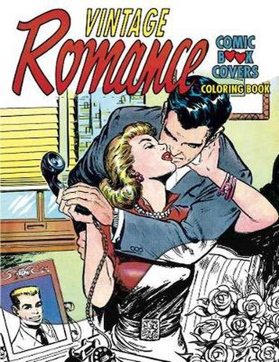

{width=50%}

I think I can have a piece of the romance novel market. Here is a précis for you editors with your fat wallets filled with expansive cash advances for authors with sure-shot romance novel ideas. 

Check this one out. It is only one of the many bodice rippers I am outlining today.

### Title

*The Inverted Matrix*

### Main Characters

* *John*, a tweedy, 40-something, never married economist, known for laughing at inappropriate times during addresses by the dean of his college, who has bicycled to work every day for the 428 days, rain or snow, wind or calm, sun or cloud.

* *Marie*, a 23-year old, bespectacled mathematician, is doing a thesis on "Simultaneous approximation by the linear combination of modified Bernstein polynomials" that is being whispered about admiringly around her department.

John and Marie have weathered independently the *Sasser* worm on their computers without any long-term damage. Both run Linux on everything, including on their watches. Both refuse to use Microsoft anything or touch or even look toward an Apple product. They agree that working on the command line is good enough to get anything of any substance done. They know their locations, their *pwd*, at all times and can pipe commands with competence and stamina. 

Marie programmed her *turtle* in the logo coding language when she was 3.5 years old. One day John's parents found him at 7 years old, blocks away in a public library browsing discrete math textbooks, much as the parents of Jesus found him teaching at the temple. Sometimes it seems as though non-geeks do not see their inner beauty as their mothers do...but if John and Marie followed the blues masters, they would realize that their moms could just be jivin' them, too.

### Reader Requirements

It is presumed that the reader has a background in mathematics through calculus, with a particular interest in matrix algebra, an understanding of Walrasian economic systems, including Leontief models, a belief in rational economic theory *a la Lucas*, and an abiding appreciation for market economies.

### A Hot Excerpt....

After a long colloquium filled to the brim with PowerPoint slides, Marie is in John's office pouring over the matrix equations necessary to account for economic output and employment. Before them is, **X**, an *I*-by-*I* matrix of dollar transactions among *I* industries, with self-supply on the diagonal element, and **K**, an *I*-by-*K* matrix of dollar sales of industry *i* to GDP category *k*. John explains that total economic output , *y*, a 1-by-*I* vector, is merely **X** + **K**. 

Marie points out gently that the division of all elements of **X** by *y* produces a matrix, **A**, of coefficients showing the proportion of *y* transacted among **I** industries to produce a unit of total output. 

Furthermore, she asserts more forcefully, now that she sees his pupils dilate widely, that with the introduction of an identity matrix, **I**, and with a bit of substitution of a few terms, you could create a matrix, (**I** - **A**)^[inverse], that showed the marginal increase in production necessary to deliver an additional unit of output to *y*. 

To this point, seemingly devoid of any emotional life, John perks up and turns slowly to her. Their eyes meet. A blue-white hot heat rises between them. 

In this moment of epiphany, John knows that his life has been empty and that Marie has become the flower in his life. He turns to her, knocking over the cup of chai that stood cold at the edge of his desk. Their eyes meet. They both know this is love, although neither has experienced it before unless you can comprehend mystically that studying spherical geometry is love unto itself and the ages. 

Their lips meet, and so do their glasses, knocking all akimbo frames and the lanyards that attach the glasses around their necks. They trip over a stack of *National Bureau of Economic Research* bulletins, stumble over the metal clasps that tighten John's pants to his ankles as he rides his bike, and fall giddily into old, crumpled brown paper bags that John uses to bring fruit into the office and fails to throw out or recycle. 

This love, now new...... --> *and it can continue*.

...

You are thinking, **Oh, Yeh!**, I want more of that story. But maybe with a little bit of slide rule mentioned?

Come and get it, you New York acquisition editors with the LA lawyers sporting ponytails and Robert La Roche teashade sunglasses! I am prepared to dish more of this hip prose for the lonely and broken-hearted.


## Last updated on {.appendix}
```{r,echo=FALSE}
Sys.time()
```

## Reuse {.appendix}

Text and figures are licensed under Creative Commons Attribution [CC BY 4.0](https://creativecommons.org/licenses/by-sa/4.0/). Source code is available at <https://github.com/davidpassmore/blog>, unless otherwise noted. The figures that have been reused from other sources do not fall under this license and are recognized by footnoted text: "Figure from ...".

## Comments/Corrections {.appendix}

To make comments about this posting or to suggest changes or corrections, send email to [David Passmore](mailto:dlp@davidpassmore.net), send a direct message on Twitter at [\@DLPPassmore](https://twitter.com/dlppassmore), or send an IMsg or SMS to [dlp\@psu.edu](mailto:dlp@psu.edu){.email}.