```{r setup, include=FALSE}
knitr::opts_chunk$set(echo = FALSE)
```

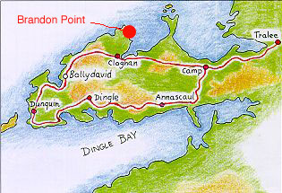{width=75%}

As I am writing this (longhand, without a computer, if you can imagine that!), it is 11:00 on a Sunday morning on the [Dingle Peninsula](https://en.wikipedia.org/wiki/Dingle_Peninsula) in far west Ireland. I reached the [Brandon Point}(https://www.wildatlanticwayonline.com/map-of-kerry-wild-atlantic-way/discovery-points/brandon-point/) after a long ride across thin, winding [County Kerry](https://en.wikipedia.org/wiki/County_Kerry) roads after a high and spectacular drive on steep cliffs over the [Connor Pass](https://en.wikipedia.org/wiki/Conor_Pass).^[`requiescat in erica maris` = `rest in the heather of the sea`]

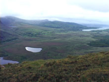{width=50%}

I just stepped over the stairway gate. The stairs are a farmer's way of keeping the sheep in but allowing people access to the land.

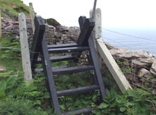{width=50%}

I am perched on a little twenty-foot crook of turf at the edge of a tall, steep cliff overlooking Brandon Bay. Surf pounds on the rocks about 150 feet below. This is a raw, green place.

Several birders are on the level ground above me with their lenses trained out to the bay, where six Bottlenose Dolphins are hunting the unwary sea birds who sit on the surface of the calm water about one-quarter of a mile from our site. It is a Sunday, but there is no rest in the animal world for a good meal.

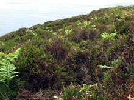{width=50%}

As I mentioned, I have no computer with me, so I am writing this in my dirty, scribbled scrawl, hoping for a straightforward interpretation and translation later. To my left -- far, far away -- is the United States. Many Irish had its vision in their minds from this point on the Dingle Peninsula long before they entered steerage to pass over to Ellis Island, to New York City, on to a new world of America, leaving these fair, green shores behind forever.

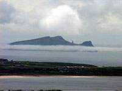{width=50%}

My seat on this ledge is soft and sculpted by heather bushes. The wind is light today, and the sun is hidden by low, misty clouds. But, it is not cold, nor is it hot.

Sea birds soar along the cliffs and, at times, trim the tops of the gently rolling sea in search of delicate piscine tidbits for their lunch. Cliff birds now whistle to each other, perhaps to signal the position of the ever-watching Peregrine Falcon that has nested on the cliff.

Every once in a while, the heather around me becomes bee-loud as it is harvested for pollen for nearby nests. The birders above me fix their lenses here and there and call out their glorious finds to each other, to be written down in their birding logs like love letters. Everything here feeds off everything else.

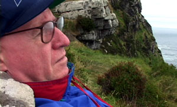{width=50%}

How often am I away in some land distant from my home when I am seized by a vision captured, in turn, from one-half a world and nearly an entire lifetime away? Today, perhaps it was brought on by passing churches with ruddy-faced people streaming from them. Maybe it was hearing on Irish Radio One that Ronald Reagan died. I don't know. But, for some reason, as I drove next to a field with a pretty gray horse in it, the little synapses fired, and I was taken back to my days as an altar boy at Our Lady of the Rosary Church in Niagara Falls, New York, my home town.

Funerals provided an excellent way to be both devious and devout when I was young. Luckily, the deceased would have the courtesy to pass over on such a day to allow the scheduling of a funeral rite on a school day. No tests, no recitations, no memorization of the times table, no diagramming of compound sentences could keep the altar boy from his sacred duty to serve at a Catholic burial rite. The Rite of Reception, the Liturgy of the Word, the Liturgy of the Eucharist, and the Final Commendation and Farewell required our expert services.

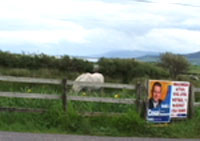{width=50%}

Oh, how it might have infuriated our captors -- Sister Mary Modesta, Sister May Lucina, Sister Mary Elsa, et al. -- that we were excused from school for a full, delicious two or more hours for a morning! Most mornings, we would be humiliated by being asked to recite from memory those golden nuggets of Catholic doctrine encapsulated in responses to questions outlined in our *Baltimore Catechism*. A funeral allowed us to tip our hats to these captors and our fellow prisoners and move smoothly over to the church sacristy to prepare for the solemn task of poling the dead across the River Styx.

Boys who could muster a certain gravitas were chosen to serve at the burial rite. No snickering. No staring. No hesitation in Latin responses to the priest's incantations. No fault in ritual could be broached. Ornaments in the burial process, we were to be part of the tableau remembered by the family of the deceased.

The alter boys assembled and donned ill-fitting cassocks that made us like frumpy junior priests. Then, we pulled over our heads great, white, fluffy blouses that seemed more appropriate for pregnant women. The priest was in black vestments. This black motif changed around the time of Vatican II to white to represent joy at death. In *The Histories* by Herodotus^[thought to have invented `history` as a field of study], we read about an ancient tribe that wept at the birth of a child because of the suffering it would endure in life. However, the tribe had a bang-up wang dang doodle of a party when a person died because the trials of the world were over for the person. Everyone seems to have a cultural ritual around death.

As the time arrived for the funeral, the bell in the church tower would toll slowly and solemnly. The hearse would arrive, with the relations and friends of the deceased following in separate cars. Before we left the sacristy, the priest would cuff the worst lunkhead among us on the back of the head and warn us all: "No slip-ups! Remember what you are doing!"

We would process to the church's vestibule to meet the coffin carrying the deceased's body, followed by family and friends. The two most trustworthy of the altar boys would unfold a black pall and drape it over the casket with the help of the undertakers.

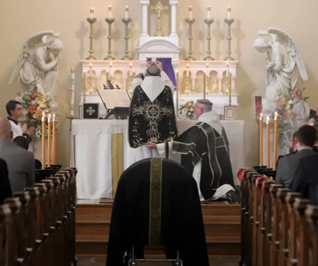{width=50%}

At this point, we could size up the mourners. As they entered the church, the full weight of the death seemed to settle on the mourners. Eyes would redden. Sometimes, the entire family clustered like a clutch of small, frightened puppies. At other times, children or brothers and sisters hung apart, as they had when the deceased was alive. The weak rested on the strong. The entire family dynamic sculpted itself in front of us.

We would turn and lead the procession of the draped coffin, the undertakers, and mourners to the front of the church. Six tall black candles stood in the silent honor guard at the casket's side as it stood before the altar. Mass would begin.

For most of my years as an altar boy, Mass was recited in Latin. The majority of the laity could not tell what was going on without translation cards. Deeply mysterious! The non-Catholics in attendance were bewildered by the standing, the sitting, the kneeling, and then standing again. Why? When? Their faces showed their muted irritation at this Latin, Popish ritual.

At times, the family would request a High Mass, which involved more candles and lots of singing (in Latin, of course). More time on the clock for us altar boys before we went back to the Island of Punishment, Humiliation, and Boredom in the sovereign state of our school.

But what great luck if the family requested a Solemn High Mass! This would involve three priests and more altar boys in a great act of distributive justice. And, best yet, the Solemn High Mass lasted the longest because the ritual was sung amidst pauses for waving of thuribles of incense all around. As a side note, I always thought that the boys who served funeral Masses at the Orthodox churches had it best. Man, they sing everything...three times...and incensed is delivered by the truckload.

The end of the Mass always ushered in a difficult period. The priest would chant, and the choir would answer:


>| *Ego sum resurrectio et vita*
| I am the Resurrection and the Life.

>| *qui credit in me etiam si mortuus fuerit, vivet et omnis qui vivit*
>| He that believes in me, though he were dead, yet shall he live,

>| *et omnis qui vivit, et credit in me, non morietur in aeternum.*
>| and every one that lives, and believes in me, shall never die.|


These were profound, solemn words, intoned during a sad, slow march. This march signified for the family that the internment was near and a move closer to the cemetery would occur. Tears would flow. Sobs would often be heard. The undertakers would move forward to turn the coffin so that the deceased left the church head first.

The undertakers. A distinct lot, as I began to learn after serving at many a funeral. In Niagara Falls, an ethnic town, an undertaking service was available for every ethnic group. For instance, the Tubinis Funeral Home and the Zajac Funeral Home served the Slavic population. The Rooney Funeral Home seemed to be favored by the Irish. The Williams Funeral Chapel served only Black families. The Maggadino Memorial Chapel was for Italians. Of course, lines were crossed, but not often.

The Maggadino Memorial Chapel seemed to me to be the most interesting. It was owned by Stefano Maggadino, a reputed Mafia boss who, it is said, figured in the John F. Kennedy assassination in his own little way.

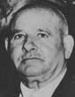{width=50%}

Rumor was that the Maggadino Memorial Chapel had a secret level below the funeral home from which the Maggadino crime empire was run. Hints were whispered of burials of murder victims double-stacked with somebody's grandma. Few know -- and, as they say, the rest aren't talkin' -- whether this was true. However, these dark stories fueled the imagination on long, dark, cold nights as I walked from the city library, passing the Maggadino Memorial Chapel on my way home.

There was no doubt, though, that undertakers from the Maggadino Memorial Chapel were the real deal among the altar boys. Man, they looked like [wise guys](https://www.merriam-webster.com/dictionary/wise%20guy)! Dark. Secret. Mustachioed. Fit and tailored well into dark suits--pinstripes, in fact. Dark glasses topped it off. They never secretly smiled or winked at us as the other friendly funeral directors did. Hard.

I frequently saw at services the same undertakers from the Maggadino Memorial Chapel. You could never figure out what was going on in the brains behind those deep black shades. Seriousness? Agita? Meditation? 

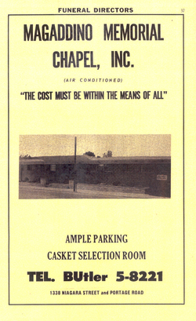{width=35%}

At the point that arrived in one funeral service when the body was to be turned to leave the church head first, nothing happened. The priest waited for several uncomfortable beats for the undertakers to turn the body. Nothing happened. I subtly raised my chin a little bit in the direction of one of the Maggadino guys. You could see he was startled out of whatever reverie he had fallen into. He moved promptly in a kind of twitch that was atypical of the cool, smooth movements that went along with being a *goomba*. The casket was turned. All moved forward without a hitch from that point.

I was outside my school during the lunch period the day after the funeral. A black car drew up to the curb. With shades still on and a cigarette dangling from his mouth, the undertaker stepped out of his car -- and he started *walking toward me!* Was this the end? Had I crossed his macho line by nudging him to move the casket? I developed a kind of *rigor mortis* that I am sure he had seen that very day in one of his "clients."

He walked up to me, pulled out a wad of cash wrapped with a gum band, peeled away a $10 bill, and handed it to me. He leaned forward to say, "Hey, you're a good kid." And, then, those ever-horizontal, razor-thin lips curved into a sort of smile. Instant cool spread over me. Rather than being ball batted by this guy, we were *paesano* at that moment. I had saved him from professional embarrassment. I expected to hear something like, ["Someday -- and that day may never come -- I'll call upon you to do a service for me. But until that day...."](https://www.quotes.net/mquote/37352). Nope, he got back into his car and drove away.

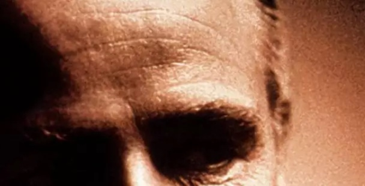{width=50%}

But I digress.

As we headed the procession out of the church, the priest would say softly to the coffin as he sprinkled it with ashes, "Memento, homo, quia pulvis es, et in pulverem reverteris," that is, "Remember, man, that thou art dust, and to dust thou shalt return." Sobs often would become full, heavy tears and loud cries, giving us young altar boys a complete sample of human grief to ponder and weigh like budding little scientists of the soul.

We parted company with the corpse at the door of the church. We were not allowed to go along to the cemetery because this would part us from our studies for even more time. We didn't really care to go anyhow because absence would have cut into our bologna sandwich, chocolate cake, and milk time, and we would miss several games of [Red Rover](https://en.wikipedia.org/wiki/Red_Rover). Nope, by this time, we were eager to return.

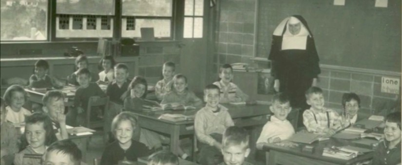{width=50%}

Coming back to class in the afternoon wasn't too bad. After all, we had missed one-half of the school day! And, we were absent for a reason for which our nun-wardens could not find a reason to beat us on the knuckles with their meter-long, metal-tipped rulers. Service is such an honor, after all.


A Peregrine Falcon just killed a small sea bird to my left. Dinner for him. A funeral, perhaps for the little bird's family? I wonder if, in bird society, some young birds will get a chance to loaf at a bird funeral. 

{width=50%}

Now, I am off from this sacred place on Brandon Point on this Sunday to my next destination, [Castlegregory](https://en.wikipedia.org/wiki/Castlegregory) in County Kerry on the [Dingle Peninsula](https://en.wikipedia.org/wiki/Dingle_Peninsula).

I say, *Ite, missa est.* And, you respond, *Deo gratias*.

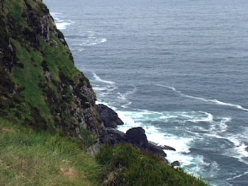{width=50%}


## Last updated on {.appendix}
```{r,echo=FALSE}
Sys.time()
```

## Reuse {.appendix}

Text and figures are licensed under Creative Commons Attribution [CC BY 4.0](https://creativecommons.org/licenses/by-sa/4.0/). Source code is available at https://github.com/davidpassmore/blog, unless otherwise noted. The figures that have been reused from other sources don't fall under this license and can be recognized by a note in their caption: "Figure from ...".

## Comments/Corrections {.appendix}

To make comments about this posting or to suggest changes or corrections, send email to [David Passmore](dlp@davidpassmore.net), send a direct message on Twitter @DLPPassmore, or send an IMsg or SMS to dlp@psu.edu.
