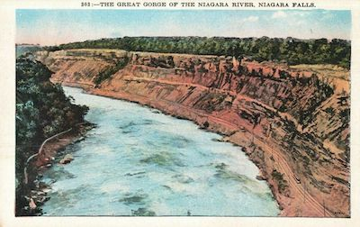
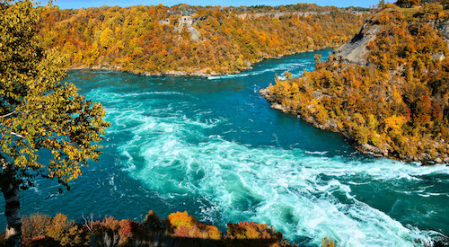
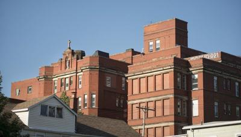
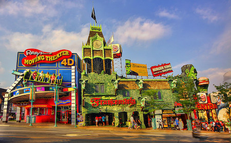
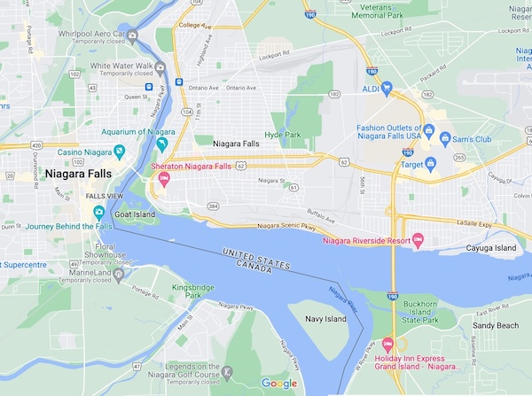

```{r setup, include=FALSE}
knitr::opts_chunk$set(echo = FALSE)
```

{width=75% .external}

Over a low stone wall across the road is the Great Gorge of Niagara. I am sitting in a breakfast cafe of a Canadian hotel about a mile downstream from the Falls of Niagara. Both great waterfalls, the Horseshoe Falls and the American Falls, are on duty, even before a significant Western secular and worldwide spiritual holiday like Christmas day.

For ages, the water has kept flowing and falling, slowly carving an abyss through Lockport Dolomite stone and constantly stepping backward over the equally vast chasm of time of far greater depth of space and length of time than the cheap trinket shops, tourist traps, and manufactured "great views" that now populate its shores and exploit its beauty.

Yes, the Niagara River rolls and boils on. Geologists tell us that the Falls of Niagara eventually will become the Falls of Buffalo as the river cuts its way, inch by inch, between Lake Erie and Lake Ontario, two of the so-called Great Lakes in the United States of America. I will become less than dust in the fullness of time, swept up and diffused about the world to land into hamlets in Austria and wells in China and, without rest, whisked around by the sharp, unrelenting winds of Patagonia. I will become someone else's grit and grime. But, the Falls will continue relentlessly and without regard for the dust of me and of the millions who have stared at it in awe and captured its dynamic image on tiny Kodak Brownie cameras.

The Great Gorge across the road is less than a quarter-mile wide and is perhaps, 300 feet deep. The Gorge is more than a physical separation between two pieces of land. Sure, it separates Canada and the United States of America. Also, it separates two cultures, Canadian and American, which deceive us by seeming similar. The two countries share television, radio, news, products, and production. Each country's money is discounted and exchanged daily across each other's borders. Then, of course, there is hockey, which knows no boundaries, does it? And, the two countries' peoples are friends -- most of the time. Yet, the subtle differences in socialization, temperament, values, and, if it is possible to use such a hefty word, culture between the two countries are easy to miss. One hint is in the difference in spoken language.

{width=75% .external}

I listen as I eat breakfast this morning. A Canadian voice is as distinguishable to me anywhere. The slightly Scottish, slightly formal speech and the inclusion of "eh?" at the end of many sentences are as identifiable to me as the nasal, long vowels so common just one-quarter of a mile across the Gorge (to get a feel for this western New York pronunciation, say the word, "aunt," while making your mouth wide like a smile that shows all of your teeth and try it with such words as "Alice," "Niagara," and "eight.").

I grew up across the border in Niagara Falls, New York. If a few new buildings were torn down, I probably could see the hospital of my birth, St. Mary's Hospital on 6th Street, across the river through the morning fog and through the mists drifting from the thundering Falls just a short distance to the south. 

{width=75% .external}

Niagara Falls holds a prominent spot in the history of industry, economics, and innovation in the United States. It was the first place that alternating current electricity was transmitted over a distance (it lit the street lights of Black Rock, a tiny community outside of Buffalo about 15 miles to the south). It was and is the home of many petrochemical industries that rely on cheap electrical power to separate constituent chemicals and huge electrical furnaces that use high heat from electrical arcs to smelt titanium and fuse industrial carbides.

Because it has become a mecca for tourists ("the honeymoon capital of the world"), Niagara Falls is a sales spot for every cheap trinket and a flashy bit of apparel that could be manufactured in the sweatshops of the developing world. The cheapo, plastic Indian drums, Indian hatchets, Indian peace pipes, and Indian headdresses. There are key chains and bottle openers in Day-Glo colors. If these pieces do not satiate your primary tourist's need to acquire memories, then bins are available of over-sized pencils adorned with tassels, wooden as well as plastic back scratchers, tiny 3" x 5" pine houses (a decal says "Niagara Falls" in arcing letters) designed to hold burning cones of pine incense in their chimneys, clear plastic containers which, when shaken, create a shower of snow falling over the Falls or over the downtown Niagara skyline, and, of course, shirts, sweatshirts, and sweaters that have silk-screened messages proclaiming "My grandma went to Niagara Falls and only bought me this crummy t-shirt," "What are you looking at?," "I'm with him -->," "UP YOURS," "I've worked years to get this beer belly," "Kiss Me, I'm Irish!," "Whiskey is a food group, and I need to eat," and "Foxy." " 

{width=75% .exernal}

But, tons and tons of green-cast, bubbling water per minute continue to surge over the Falls, oblivious to this tacky impedimenta, just as they were unknown to and never imagined by hunters in loincloths and bearskins carrying bows, arrows, and spears many, many years ago and to the great wars fought by the French, the British, the Indians, and the European settlers not so long ago on the plains of western New York, southern Ontario, and in the Great Gorge itself.

The Japanese have a word for what Niagara Falls means to me: *ba*. To the best of my understanding, *ba* is translated loosely as "place." It is a fine, short word that, when spoken, starts with a pop of the lips and ends with a puff. *Ba* denotes not only a physical space but also a specific time and space nexus. As Heidegger expressed once expressed a similar concept, it is a locationality that simultaneously includes space and time. The existential *ba* must be experienced, which leads to transcendence beyond one's own limited perspective and boundary.

To those who never have seen or experienced Niagara Falls, I will tell you that I have stood many times at the base of the American Falls, down where water pounds on rock forever, where your vision is engulfed by the enormity and speed of the cascade, and where the air is, at once, 10 degrees cooler than on the plains above the Falls from which the water tumbles over. Fine particles of water -- a great, enveloping mist -- are all around. It is a wild, *SurroundSound* show of Nature for which you need to buy no ticket.

You actually can perceive the smell of wet in the grand sensual mix of refracted light, droplets of water, and swirling air filled with the detritus of the great cities along the Great Lakes of the United States and the headwaters and eventual tributaries that supply them. A smell of ozone is in the air as water molecules are pummeled as they hit the weathered rocks at the bottom of the steep cliff that forms the Falls of Niagara. 

To perceive Niagara Falls this way is to perceive America in a fleeting instant. Not the land of McDonald's and Wal-Mart, but the very essence of America that is mixed, matched, heated, and forged over centuries of early and modern life of humans, animals, and vegetation, then pounded and washed on the rocks below the Falls, and, for just one moment, released by Nature for your primitive education and wonder.

My coffee today is a lukewarm tea-colored swill, served in a Styrofoam cup, without any decoration, much like the weather outside today, the day before Christmas in Niagara Falls, Ontario, Canada, across from my hometown, Niagara Falls, New York, USA. 

{.external}


## Last updated on {.appendix}
```{r,echo=FALSE}
Sys.time()
```

## Reuse {.appendix}

Text and figures are licensed under Creative Commons Attribution [CC BY 4.0](https://creativecommons.org/licenses/by-sa/4.0/). Source code is available at https://github.com/davidpassmore/blog, unless otherwise noted. The figures that have been reused from other sources don't fall under this license and can be recognized by a note in their caption: "Figure from ...".

## Comments/Corrections {.appendix}

To make comments about this posting or to suggest changes or corrections, send email to [David Passmore](dlp@davidpassmore.net), send a direct message on Twitter @DLPPassmore, or send an IMsg or SMS to dlp@psu.edu.
