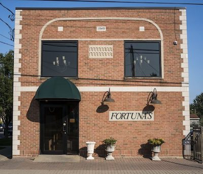
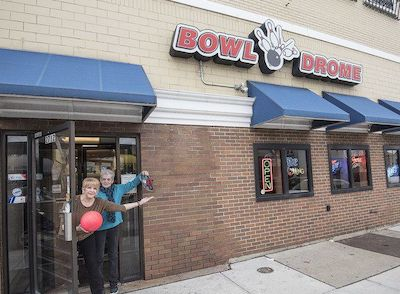
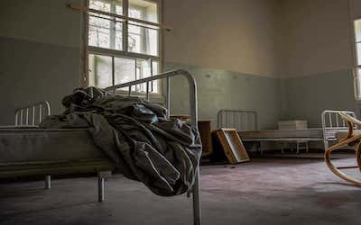
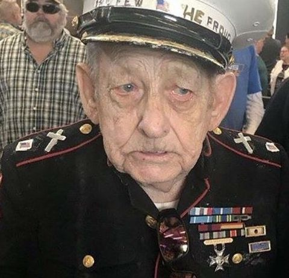

Are we evolving to be less generous in spirit? Some might say it is so. I am sure that generosity still is well-distributed. Maybe I am running into fewer generous spirits than I have in the past. Maybe you must be one to see one. I don't know.

A man named George Pinkerton worked with my father in Niagara Falls at the Autolite Battery factory as an office clerk. George had no hair on the top of his head, but he had a ring of black hair from one ear, around the back of his head, and on to the other ear which made him look as though he had a monk's tonsure.

George wasn't called George. He was known as "Pinky." Not as degrading and diminutive as it first sounds. It was a name of affection assigned to a friendly man. You see, Pinky was short, maybe 5'6". He was no stranger to good food. His face was round, to match the rest of him. Often, plunked in the mouth, was a fine large cigar.

Pinky had no chin. Not that he had rolls of fat around his neck. There was just no chin. The flesh dropped straight from the tip of his mandible to his chest. He had a warm smile and sparkling blue eyes. The eyes smiled with the face, and the total effect when you came upon him was one of a friend well met.

Pinky never forgot me on my birthday, at Christmas time, at Easter, or on any of the major events, like my first communion or confirmation, in my young life. I think I have a pink little elephant in a musty box in the lower level of my house that Pinky gave me. He was the manager of the factory baseball team. He always seemed like an organizer, a doer, someone you could rely on.

Pinky eventually quit the factory when manufacturing employment took a dive in Niagara Falls. He opened a small store called *Pinky's Corner*. Such a full service little store does not, I believe, exist any more in the United States. He had bread, milk, canned goods, beer, and all. But, he also had a meat counter, in front of which there were wood chips on the floor.

Pinky's wife, I found out later, was an alcoholic, as was his son. Pinky eventually remarried. He was one of the few people my father knew from his 38 years of work for Autolite Battery who called periodically to inquire about my father when he became disabled.

We were living in Iowa (getting ready to move to Pennsylvania) when my father died. The expense was so great that I was the only member of my Iowa family to be able to travel back to Niagara Falls for the funeral. Sure enough, during the first night of the wake, Pinky and his wife appeared, bringing much warmth to the room. They insisted that they take my mother and I out to dinner in a few days after the funeral. We accepted.

Pinky and his wife took my mom and I to Fortunas, an Italian restaurant in a Niagara Falls neighborhood. Places like Fortunas still exist in Niagara Falls. Small, family-owned, with great pride in the quality of food prepared for a reasonable price.

{width=50%}

What a warm time we had. Lots of memories. Pinky and his wife were good listeners, so they let us babble on about our lives and about my father. They knew that it was important to let us talk about these things.

Then, Pinky's new wife told us something that startled me: Pinky's ex-wife lived with them until she died. She explained that Pinky's ex-wife's alcoholism had grown especially severe and her personality had become so intensely virulent that she had no social network at all. Then, with a malignant cancer, she was on her own. They took her in because she needed help. They took her in knowing that she would be a real hand full. They took her in, even though she had no money. This struck me as incredibly generous.

Generosity was what Pinky was about. Perhaps one of the most important lessons I learned was from Pinky and my father during our Sunday jaunts. Our family would go to church. Then, Pinky and my father let me tag along when they visited sick and poor old men. Then, after buying and eating dream-filled sugar donuts, Pinky, my father, and I would go bowling at the Bowl-O-Drome on Pine Avenue in Niagara Falls.

{width=50%}

When I write "sick and poor old men," I mean the most godforsaken wretches just one step up from sleeping on the street. This was not an era of rest homes, personal care facilities, and the like. No, there was not the variety of care for older people that is available now. Rather, these men lived in a variety of houses, most of which had converted their third floors into wards of sorts of three to six beds. The beds were these old metal-framed beds that looked to me as though they had seen service during the civil war (many of the men looked old enough to me to have served, too). The owners of the house received the pensions of the men whom they took in.

{width=50%}

My father and Pinky would bring these men cigarettes and small talk. None of these visits were religious in the sense that people were offered religious tracts, icons, or speeches. But, they were religious in the sense that you could feel the spirit that surrounded the visit.

I must say that these visits were not easy for me as an eight-year old. The old men often were covered with bed sores. They needed a shave and a bath. And, the smell of urine and worse was very strong, almost overpowering for a young nose. Worse yet, for me, was that these decrepit, bedridden, rheumy-eyed men talked to me. "Well, hello, young man. What's your name? Do you go to school?" I answered in quiet, small, terse sentences, barely looking into their eyes, never able to once see that they once may have had a child such as me or even that they might be remembering that they were once small, frail, and innocent as I was.

My father and Pinky told me that most of the men were veterans and that they had come upon hard times. I remember one time that we walked into one room to find a man who was almost comatose and was lying in his own urine and filth. My father called the owner of the home, a gray-haired women in a house dress, into the room and asked her why this man was in this condition. She replied, "What can I do? You clean him up and he gets the place a mess again." My father said that the man looked as though he had been in the filth for a long time, perhaps since the day before. The owner said, "I just don't have the time."

{width=50%}

My father and Pinky asked her for a change of bedding and bed clothes. Pinky rounded up a basin, a washcloth, soap, and a towel. My father drew some drinking water. I recognize now that this man probably was dehydrated. The smell was horrible and the sight was ghastly.

I sat on a chair in the room while my father and Pinky stripped the man and the bed. They re-made the bed and washed him. Then, Pinky took a straight razor and shaved him. They combed his hair. I think the wash and shave and the water did wonders for this man because he started talking to us. I don't know to whom he would be presented in this smelly, hell-hole on the third floor of an old house on 19th street in Niagara Falls, but he was, indeed, presentable when it was all over. This act of kindness and service made a deep impression on me. How could Pinky and my father do something so personal for this man in a way that required them to ignore his wretchedness and to scrupulously avoid showing their revulsion at the plain horror of this man's person and his situation?

After giving the man his carton of cigarettes (probably one of the few pleasures left for this man), my father, Pinky and I said goodbye and Pinky promised that we would be back next week. Then, we went to see the hag who ran the place.

I stood holding my father's hand while Pinky told her in a kind voice that the man in the room had served his country, that his bed was to be kept clean, that he was to be kept clean and shaved, and that he should have water available by the bed. She replied, "I run this place, and I'll work it the way I want." My father said calmly, "We will be back next week. You receive money from these men. We will report you if we see these men in the same condition." Calm, direct, simple, believable.

The next week we did return,and things were better. However, I am sure that my father and Pinky were pushing the rock of Sisyphus here. Most of the time we went out, got our donuts, bowled our game, and never talked about what had happened. It wasn't lost on me, though. I never forgot their generosity with this man and the others they ran across.

{width=50%}

So, the coffee of the day is Orange Seville drawn into a 16 ounce paper/plastic cup at Wegmans Wireless Internet Cafe, held up to the morning light, and drunk in perhaps the only salute Pinky and my father have had in quite a while, if at all. Perhaps their equals are committing acts of corporal mercy right now. However, I don't see them. And, in the sum of my life I never have equaled Pinky and my father's generosity with that one man. It is very humbling realization.

## Reuse {.appendix}

Text and figures are licensed under Creative Commons Attribution [CC BY 4.0](https://creativecommons.org/licenses/by-sa/4.0/). Source code is available at https://github.com/davidpassmore/blog, unless otherwise noted. The figures that have been reused from other sources don't fall under this license and can be recognized by a note in their caption: "Figure from ...".

## Comments/Corrections {.appendix}

To make comments about this posting or to suggest changes or corrections, send email to [David Passmore](dlp@davidpassmore.net), send a direct message on Twitter @DLPPassmore, or send an IMsg or SMS to dlp@psu.edu.

```{r setup, include=FALSE}
knitr::opts_chunk$set(echo = FALSE)
```

Distill is a publication format for scientific and technical writing, native to the web.

Learn more about using Distill at <https://rstudio.github.io/distill>.


