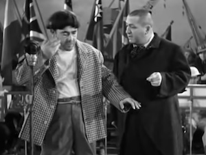
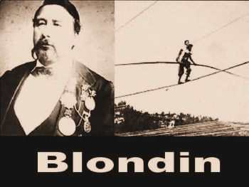
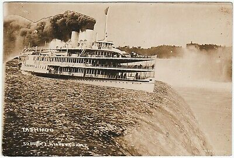
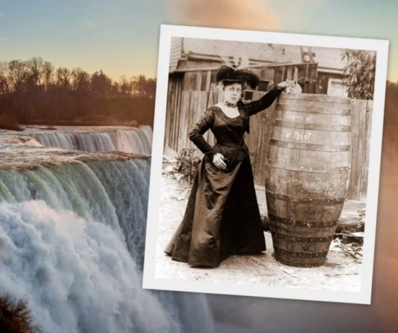

```{r setup, include=FALSE}
knitr::opts_chunk$set(echo = FALSE)
```

In the short feature movie, “Gents Without Cents,” made in 1944, the Three Stooges —- Curly, Larry, and Moe —- are out-of-work vaudeville actors who marry three dancing girls and honeymoon in, of course, Niagara Falls.

At one point, Curly mentions Niagara Falls. Moe, acting out some post-hypnotic suggestion, responds with the line, “Slowly I turned, step by step, inch by inch...I took my revenge.” *Click to view the Stooges in "Gents Without Cents:"*

[](https://youtu.be/MYP1OBZfFK0 "Stooges"){width=50%}]

This trademark Three Stooges’ line draws guffaws from fans everywhere. Much to the puzzlement of younger folks, otherwise serious and substantial adult men and women still recite this line whenever they hear the trigger phrase, “Niagara Falls.” Don’t ask me why. As Jay Leno once said, “Half the world loves the Stooges, and the other half wonders why.”

The “Slowly I turned...” line often appeared in skits on the vaudeville circuit. The line was performed in Bud Abbott and Lou Costello stage acts. It even surfaced in an episode of the “I Love Lucy” television show. Vaudeville might be dead, but Niagara Falls still delivers great absurdist farce regularly.

{width=50%}

Last week^[Remember, this is 2003!], for instance, a Michigan man climbed over a wrought-iron barricade above the Horseshoe Falls on the Canadian side of the Niagara River, stepped into the water, and was swept over the Falls. Bystanders reported that he went over the 167-foot precipice with his hands clasped behind his head and a smile on his face.

Amazingly, the Michigan man lived, the second person known to survive a plunge over the Falls (The other was a seven-year-old boy in a bathing suit and a life vest). However, he took home some great souvenirs consisting of a few sore ribs, a hunk of moss that he grabbed as he scrambled to land, and a criminal record in a Canadian court “for mischief and for unlawfully performing a stunt.” Who says Canada is not fun?

The Michigan man is the latest in a long line of Falls hoppers. Perhaps you know Niagara Falls as the “honeymoon capital of the world,” a distinction that the attraction grabbed in the early 1800s after relatives of Napoleon Bonaparte and the daughter of U.S. Vice President Aaron Burr both spent their honeymoons at hotels near the Falls.

However, one of the least publicized facts about Niagara Falls is that each year about 40 people commit suicide by pitching themselves over the cascades of Niagara. In fact, Niagara Falls also is the “suicide capital of the world,” with an estimated 5,000 tragic deaths since 1850. The only near-rivals are the Clifton suspension bridge near Bristol in the United Kingdom and San Francisco’s Golden Gate bridge, each with about 1,000 suicides since 1864 and 1937, respectively. A

{width=50%}

A letter to the editor of the *Journal of the American Medical Association* (1971;215(5):797-798. doi:10.1001/jama.1971.03180180071024) reported that:

>Systematic records of suicides and suicide attempts have been kept by the Niagara Frontier State Parkway Police in Niagara Falls, NY, for some years. The records were examined for the period 1958 to 1967. In this period an average of 5.7 attempts took place each year (range, 0 to 13) and an average of 7.1 successful suicides (range, three to ten). Of the 71 suicides completed bodies were recovered for all but 15. These 15 cases in which no body was recovered were mainly of persons observed going over the falls, or for whom evidence pointed to a possible death from having gone over.

Ah, but you ask, what about the daredevils and the spectacles associated with Niagara Falls?

Niagara Falls has to be one of the most theatrical settings in the world. In the 1850s and 60s, Jean-Francois Gravelet, known as “The Great Blondin,” crossed the Niagara Gorge on a tightrope numerous times. On separate occasions, he crossed it on a bicycle, blindfolded, while pushing a wheelbarrow, with his hands and feet manacled and with his manager on his back. On one occasion, he even stopped midway to cook an omelet on a portable grill.^[Turns out that President Abe Lincoln was a huge fan of Blondin, but that is another story.]

{width=25%}

{width=50%}

In 1827 as a publicity stunt, local hotel owners sent a condemned lake schooner, “The Michigan,” over the Horseshoe Falls with a dozen or so wild animals placed on board before an estimated crowd of 15,000 people. The animals placed on board the doomed ship included a buffalo, two small bears, two raccoons, a dog, and a goose. The schooner was decorated to look like a pirate ship, with dummies of humans tied to the deck to further add to the stunt.

As The Michigan reached the rough rapids above the Falls, its hull was torn open and began filling with water. The two bears running loose on deck jumped free into the rapids and swam to the shore. Other animals caged or tied to the ship died when the schooner went over the Horseshoe Falls. Only the goose survived the plunge.

{width=50%}

Then, some went over the Falls in barrels or contraptions assembled from rubber, fishnet, canvas webbing, sheet metal, inner tubes, tarp, or steel, which were not always seaworthy. Until our intrepid Michigan man, ten people actually made it over alive. Two of them are women. Bobby Leach was one who over the Falls, but he died fifteen years later in New Zealand due to an infection from a wound incurred from slipping on an orange peel. Sadly, though, five daredevils died in their attempts.

{width=50%}

Two who died accumulating the most style points while trying have to be Jessie Sharp and Robert Overacker. Sharp thought he could make it over safely in 1990 if only he paddled his kayak hard enough. His body never was found.

{width=50%}

Overacker’s endeavor proves how vital planning is. He made his attempt in 1995 on a speeding jet ski. He deployed a rocket-powered parachute just as his jet ski hit the Falls' brink to propel himself out to the middle of the river away from the pounding water and sharp rocks below. The rocket worked, and the parachute opened gracefully over the middle of the river. Unfortunately, Overacker forgot to attach the parachute to his back. Rescuers eventually found his body in the foam below.

It's a great spectacle held continuously in the Niagara Falls ring in the honky-tonk tent of the great cosmic circus.


## Last updated on {.appendix}
```{r,echo=FALSE}
Sys.time()
```

## Reuse {.appendix}

Text and figures are licensed under Creative Commons Attribution [CC BY 4.0](https://creativecommons.org/licenses/by-sa/4.0/). Source code is available at https://github.com/davidpassmore/blog, unless otherwise noted. The figures that have been reused from other sources don't fall under this license and can be recognized by a note in their caption: "Figure from ...".

## Comments/Corrections {.appendix}

To make comments about this posting or to suggest changes or corrections, send email to [David Passmore](dlp@davidpassmore.net), send a direct message on Twitter @DLPPassmore, or send an IMsg or SMS to dlp@psu.edu.


