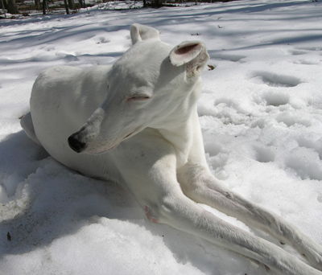
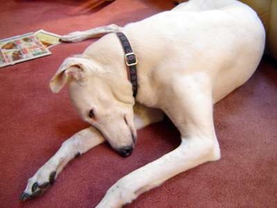

```{r setup, include=FALSE}
knitr::opts_chunk$set(echo = FALSE)
```

*Bianca, 1996-2007...*

It was a sad day on which I had to take our white greyhound, Bianca, to the vet for her final walk. When she was two years old, we acquired her from a person in the Pittsburgh area who placed retired racing greyhounds into good homes. She lived with us and at least three other of our hounds (two now deceased and one still lounging by the fire at this very moment).

Bianca had a good home here. She was a good dog, too. Never once did she perform an aggressive act. No biting. No growling. No underhanded deeds. No stealing the bologna when no one was looking. Grandchildren slept on her without a wiggle from her in response. You dog owners know how rare this is.

To be sure, Bianca was fearful of things. Thunder. Loud, sudden noises. Shouting people. Just like people are. But, so few moments bring real sadness. Good, crunchy food, topped by a dollop of gooey, soft meat: That's the way to happiness. Long naps in a cool breeze or beside the hearth, all warm and glowing. A sharp, playful bark. A run and a tussle in the yard. A stitch or two when she ran on something sharp. Just like the rest of us sentient beings.

Sentient beings.

Dogs are, don't you think, the perfect Zen entities? They place great importance on moment-by-moment awareness and seeing deeply into the nature of things by direct experience. Dogs as Zen masters. Look deeply into those inscrutable eyes. Do you see fear? Is there attention and interest? Is there being and nothingness? Well, maybe nothing so deep. I always felt that dogs had three wires in the brain: sex, food, sleep. All else is just there.

In the end, it was osteosarcoma in her leg that did her in. Metastasized to her lungs. Yesterday or the day before, she probably experienced a pathological leg fracture. She could not walk well at all. She was awake all night, panting and restless. She slept most of today under pain medication.

Now was the time as we had planned with the vet weeks before.

This is the seventh dog I have taken to the vet to be put down. The first time was when I went with my father to have my first dog, Duke, put down. The vet wanted me to leave. My father had the wisdom to tell him I could stay if I wanted. Staying became so important because I was sure, as only a silly 12-year old can be, that the vet was really just faking it. He would take my *Heinz 57 Variety* dog, which I thought was the most beautiful big brown dog in the world, and give him to someone else. The dog had arrived two years before, and, as an only child, he often was my only companion. The experience of taking a dog on its final walk since has never been easy, but it has been necessary.

As with most of the others (Duke, Cookie, Dolly, Sparky, Sophie, Lewis), it was just me in the room with Bianca and the vet. I held her head in my hands on my lap and reminded her that every dog has its day. And, then, she folded into the cold and damp night to a sleep so quiet that all air and light seemed to freeze around me. The last walk through the door, my companion. Feel free to canter ahead gaily.

To my surprise, tears rolled down the vet's face. He told me that, just the year before, his wife had died of osteosarcoma. The vet confessed that he wished he could have taken away her pain as he had just done with Bianca.

Here is a picture that my daughter, Ann, took as Bianca slept in the bright sun, in her favorite spot, in the back yard, in the snow:

{width=50%}

And, here, another a few minutes before I took her to the vet:

{width=50%}

So, in honor of my dear little white dog, Bianca, and all of her four-legged friends of men, women, and children, I offer my reading of Lawrence Ferlinghetti's poem, *Dog*:

<p><audio src="https://davidpassmore.net/DogDave.mp4" controls="controls">
Your browser does not support the audio element.
</audio>
</p>

>You think dogs will not be in heaven?  I tell you, they will be there long before any of us.   ~Robert Louis Stevenson

## Last updated on {.appendix}
```{r,echo=FALSE}
Sys.time()
```

## Reuse {.appendix}

Text and figures are licensed under Creative Commons Attribution [CC BY 4.0](https://creativecommons.org/licenses/by-sa/4.0/). Source code is available at <https://github.com/davidpassmore/blog>, unless otherwise noted. The figures that have been reused from other sources do not fall under this license and are recognized by footnoted text: "Figure from ...".

## Comments/Corrections {.appendix}

To make comments about this posting or to suggest changes or corrections, send email to [David Passmore](mailto:dlp@davidpassmore.net), send a direct message on Twitter at [\@DLPPassmore](https://twitter.com/dlppassmore), or send an IMsg or SMS to [dlp\@psu.edu](mailto:dlp@psu.edu){.email}.