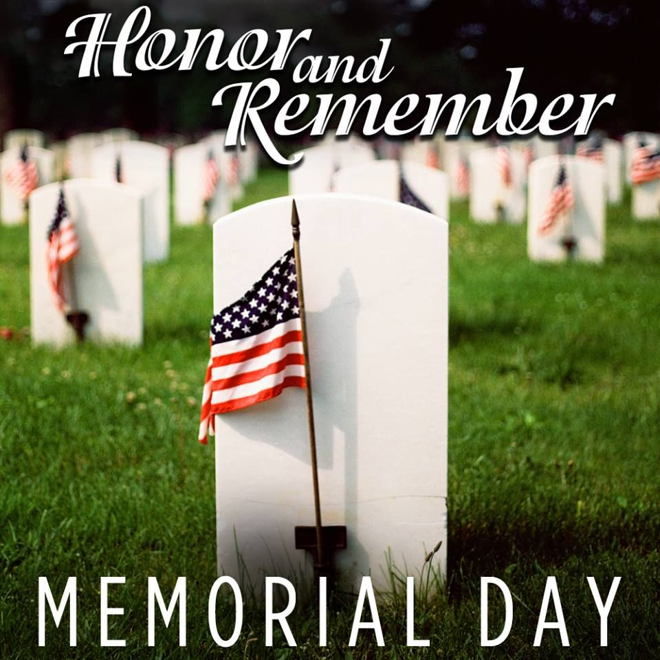

```{r setup, include=FALSE}
knitr::opts_chunk$set(echo = FALSE)
```

Several friends spoke recently about how to honor those who died in the service of their country. In the United States we celebrate *Memorial Day*, a custom observed on the last Monday of May that is meant to honor the men and women who died while serving in the U.S. military.

{width=50%}

The word, “memorial,” derives from a Latin word, “memorialis,” meaning “belonging to memory.” The Latin root also connotes a manifestation of that memory through commemorative gesture, the establishment of a monument, or the enactment of a rite.

And, so, we have our Memorial Day, a day with an abundance of memories and memorials for many Americans. Profound reflection. Prayer. Perhaps a parade and assembly at a local shrine to remember the war dead. Memories often spread to now-absent friends and family and to thoughts of the lives of those we never met, but carry in our DNA and local histories. 

For some, though, the day concludes a long restful weekend spanning spring and summer, a chance to start landscaping, or a gathering of family, friends, and neighbors for a cookout and a beer. Not everyone has palpable memories to ponder or even wants to consider any dark images they might summon. In these ways, our Memorial Day conjures a feuding horde of meanings for many Americans, much like the current state of our moral and ethical life in the United States.

By contrast, the Greeks assigned a more singular, principled meaning for a “good” death, the kind that should provoke our memory and honor. Herodotus (c. 484 – c. 425 BC), a Greek writer and geographer described as the “Father of History,” told the story of Solon and Croesus to illustrate Greek ideals surrounding death.

Croesus, an enormously wealthy king of Lydia, was visited by Solon, an esteemed Athenian statesman, lawmaker, and poet who is now known as one of the “Seven Wise Men of Greece.” Croesus wished to impress Solon with his treasure and stature. He took Solon on a tour of his holdings and spoils of war. He wined and dined Solon in splendor for days. Croesus’s wealth was proverbial in the ancient world, in which people would often exclaim that someone seemed “as rich as Croesus.”

Seeking to be flattered, Croesus asked Solon who he thought was the happiest man in the world. Solon’s answer disappointed Croesus, for it wasn’t Croesus. Solon identified three people who were happier than Croesus. One, Tellus, a simple Athenian farmer/statesman and two brothers, Cleobis and Biton, who died young.

Solon explained that Tellus was the happiest man he had ever known. Tellus was a man of moderate means, certainly no match for the splendor of Croesus. Yet, Tellus lived in a well-governed country and raised virtuous sons, all of whom produced grandchildren for Tellus to enjoy because they survived the perilous early years of childhood.

On top of these virtues, the end of Tellus’s life was most brilliant. When Athenians waged a war against their neighbors in Eleusis, Tellus joined the battle, fought valiantly, and helped rout the enemy — but lost his life. Tellus died gallantly in the service of his country. Accordingly, Athenians buried him publicly right where he fell in battle and honored him greatly. As Horace, a Roman lyric poet wrote in his *Odes*, *Dulce et decorum est pro patria moria*, or “It is sweet and fitting to die for the homeland.”

Croesus failed to discern a difference between the idea of riches and the idea of a more generalized good life. He seethed quietly in jealousy. He concluded that Solon is mocking him subtly. Croesus asked Solon to continue by telling the story of the young boys, Cleobis and Biton, who Solon believed were happier than Croesus.

The brothers, who displayed singular athletic prowess and strength, did not die gloriously in war. During a Greek festival honoring the goddess Hera, their priestess mother was called for worship to the temple devoted to the gods located some five miles away. When their mother’s team of oxen could not be located in the fields, the brothers took up the yoke of their mother/priestess’s ceremonial wagon. They pulled her wagon to the temple themselves so that their mother would not be dishonored by arriving late to lead temple devotions.

The entire gathering at the temple saw the great love of the brothers for their mother and their piety to the goddess Hera. Men stood around the youths and congratulated them on their strength. Women congratulated their mother for having borne such children. 

The mother of Cleobis and Biton was overjoyed at their feat and by the praise they received. She stood before the image of the goddess Hera and prayed that the goddess might grant them whatever was best for mortal men. 

The exhausted brothers feasted and slept that night in the temple, waiting to take their mother home on the following day. But, they never rose again. Death held them there. 
Thanatos, the bringer of death, snatched the brothers at the height of their powers, allowing them to evade the events that can fill almost every human life with some unhappiness. Their great deeds and devotion would ensure that the brothers would be talked about long after their bones had turned into dust. 

The Greeks, for whom the afterlife was a murky, aimless, dark place, believed that nothing is better for mortals than to die honorably -- especially *honorably* and *young* so as to be spared the vicissitudes of long life. As a quick glimpse into the Greek mind, so different than ours, the mother of Cleobis and Biton thanked the goddess for granting beautiful endings to the lives of her sons. As in A. E. Housman’s poem, *To an Athlete Dying Young*,

>Now you will not swell the rout /Of lads that wore their honours out / Runners whom renown outran /And the name died before the man.

Croesus could not understand why Tellus and the brothers, Cleobis and Biton, should be so honored. Weren’t they, as a modern leader once ascribed to those who die in war, suckers (a word I select to paraphrase Croesus's conclusion)? I guess that Croesus couldn’t see what was in it for Tellus and the brothers. Croesus said, “No one is stupid enough to prefer war to peace; in peace sons bury their fathers and in war fathers bury their sons.” Wasn’t it better to ensure happiness in life, wondered Croesus, by building wealth and power?

To this, Solon replied that human life is largely a matter of chance. Someone with vast wealth is no better off than someone who lives from day to day, unless good fortune attends him. Plenty of extremely wealthy people are unfortunate, although plenty of people with moderate means are lucky. 

Solon said that if a person is protected by the chance of good luck, avoids disfigurement and disease, has no experience of catastrophe, is blessed with fine children, and, in addition to all this, dies a good death, then that person deserves to be described as happy. Solon said, “Let no man be called happy before his death. Till then, he is not happy, only lucky.” 

Later, Croesus himself was toppled by Cyrus, the King of Persia. No treasures, no holdings, no power could save him from being burned alive by his captors. On his funeral pyre, as flames licked about him, Croesus cried, “Oh Solon! Oh Solon! Oh Solon! Count no man happy until the end is known!”

The probability of death for us all is 1.0….no doubt about that fact. We all will die. Marcus Aurelius wrote in one of the most withering lines in his diary that “Alexander the Great and his mule driver both died.” In the end, the most powerful conqueror on earth was, Aurelius implied, no better or no less mortal than the man who drove his baggage cart. Moreover, death’s timing is mostly unknown to us. The best opportunity for virtuous action in our lives is now, not at some vague later time.

And, to sharpen our daily quest for virtue, we must remember that a final material or spiritual accounting at death for a life's impact does not just happen to some abstract “others.” But, instead, death may visit us so near as to be among our friends and even our family members whom we hold dear -- and, yes, in a thin ribbon of a moment, to us, ourselves. 

For the most part, we are likely to know the objective facts of deaths — location, circumstances, causes. Understanding the thoughts, feelings, or awareness of others at the time of their deaths is difficult to estimate, though. We, as a result, remember only the facts and meanings that we assign to lives and deaths. These remembrances form the basis of our memorials. 

About the dead, though, we know nothing about the unfathomably deep or boundless space in which they might exist. We display our own sense of virtue when we remember and honor the dead who have rounded their lives in service to larger ideals and have paid with their lives for these efforts. And, that, for me, is a good enough reason for Memorial Day.

## Last updated on {.appendix}
```{r,echo=FALSE}
Sys.time()
```
## Reuse {.appendix}

Text and figures are licensed under Creative Commons Attribution [CC BY 4.0](https://creativecommons.org/licenses/by-sa/4.0/). Source code is available at https://github.com/davidpassmore/blog, unless otherwise noted. The figures that have been reused from other sources don't fall under this license and can be recognized by a note in their caption: "Figure from ...".

## Comments/Corrections {.appendix}

To make comments about this posting or to suggest changes or corrections, send email to [David Passmore](dlp@davidpassmore.net), send a direct message on Twitter @DLPPassmore, or send an IMsg or SMS to dlp@psu.edu.
