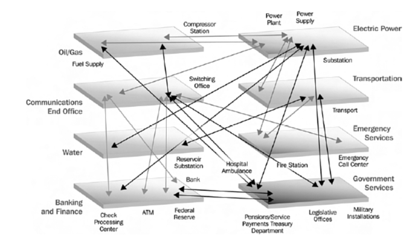

```{r setup, include=FALSE}
knitr::opts_chunk$set(echo = FALSE)
```

>Written with Rose Baker. "Think our economy is in trouble now? Just wait until a bunch of the sun is flung at the Earth!," *Pennsylvania Business Central*, *18*(10), p. 7, 15 May 2009.

Draw the shades, and douse the lights. Cue the dark, creepy music. Boil the sky with
black scudding storm clouds. Feel a damp chill as the spine tingles.

This is a scary story.

During the late summer of 1859, astronomers noted that the sun especially was active.
On September 1, Richard Carrington, a British astronomer, observed an extremely large
solar flare, a giant, energy–releasing explosion on the sun’s surface. This flare ejected a large mass of geomagnetic plasma, consisting primarily of electrons and protons, toward
the Earth.

Within eighteen hours, the Earth experienced the largest ever–recorded geomagnetic
storm. Skies worldwide erupted in red, green, and purple auroras (“northern lights”) so
brilliant that newspapers could be read as easily during the night as in the day. Auroras lit the skies so brightly in the Rocky Mountains that the glow woke gold miners, who began cooking breakfast because they thought it was morning.

Telegraph systems went wild. Electrical discharges shocked telegraph operators and
started fires. Even when telegraphers disconnected batteries powering telegraph lines,
electrical currents induced in the wires by the solar event still allowed messages to be
transmitted.

A rare event? Maybe so, but severe solar storms have had large consequences for the
Earth.

Solar storms have been disruptive in the U.S. already. For example, a huge solar flare
on August 4, 1972, knocked out long–distance telephone communication across Illinois.
A similar flare on March 13, 1989, disrupted electric power transmission from a Hydro
Québec generating station in Canada, blacking out most of the province and plunging 6
million people into darkness for 9 hours. Power surges from this geomagnetic storm even
melted power transformers in New Jersey. The same storm caused the atmosphere to
inflate and, as a result, dragged a Long Duration Exposure Facility satellite studying
extraterrestrial radiation exposure to a lower orbital height. In December 2005, a solar
storm disrupted satellite–to–ground communications and Global Positioning System
navigation signals for about 10 minutes.

Our complex and interconnected modern infrastructure depends increasingly on a
functioning electrical grid and electrical devices. Infrastructure for communications,
electrical power, water, banking, finance, and transportation sectors, to name a few, are
highly interdependent, as shown in Figure 1 from a report by the Department of
Homeland Security. A  [National Research Council report on the social and
economic impacts of severe space weather events](http://www.nap.edu/catalog/12507.html), indicated that a replication of the solar storm first observed by Carrington would result in extensive, and possibly catastrophic, social and economic disruptions.

According to the NRC report, a severe space weather event in the U.S. could induce
ground currents that would destroy 300 key transformers within about 90 seconds after a
solar pulse reached the Earth, cutting off power for more than 130 million people.
According to a [NRC map](http://grid–map.notlong.com), Pennsylvania, along with
the entire northeastern U.S., particularly is vulnerable. In fact, NRC estimates that 55% of Pennsylvania transformers are at risk.

Potable water would go first. Pumped water would stop. Without electricity pumping
water from reservoirs, water through taps would cease in four hours.
No electrically powered transport would function. Delivery trucks would run out of
fuel, with no electricity to pump gas from underground tanks at filling stations.
Back–up generators would last until their fuel ran out. Hospitals could provide about
72 hours of slim, essential care. After that, modern healthcare, as we know it, would end.

Natural gas and fuel pipelines require electricity to operate. Coal–fired power stations
usually keep reserves to last 30 days. After that, no electricity. Grid failure would trigger programmed shut–down of nuclear power stations.

People would die. Power loss would cripple major centers of pharmaceutical
production. The supply of perishable medications, such as insulin, would be exhausted
quickly.

Restoration of service would take a shockingly long time. Months. Maybe years.
Replacement, not repair, of melted transformer hubs would be required. Replacement
transformers, and the crews for installations, are scarce. Spare transformers would be
used quickly. Production of replacements could take 12 months. Transportation of new
transformers to sites would become a nightmare.

According to the NRC report, the impact of a “severe geomagnetic storm scenario”
could be as high as $2 trillion in the first year after the storm, which is many times the costs resulting from Hurricane Katrina. The NRC estimates recovery time between four
to 10 years and questions whether the U.S. economy could recover completely.

With enough warning (no less than 15 minutes), electrical utilities could harden for an
incoming solar pulse. However, satellites that form the current early warning system are
aged and becoming unreliable.

The installation of supplemental transformer neutral ground resistors in critical
locations throughout the U.S. could reduce anticipated damage from a solar storm’s
wallop by 60% to 70%. The expected costs of the relatively easy installation of these
refrigerator–sized devices are approximately $150 billion, which sounds like a pretty good bargain in our current bailout economy.

Yet, serious scientists can barely stir a yawn when they discuss the preparations for and consequences of severe solar events.

The sun's activity level rises and falls in approximately eleven–year waves. The next
solar sunspot and flare maximum is expected in 2012. Anyone have sunscreen, bottled
water, and a pet dog (they can be tasty, if prepared well) that they are willing to share?

Infratructure is connected densely:



## Last updated on {.appendix}
```{r,echo=FALSE}
Sys.time()
```
## Reuse {.appendix}

Text and figures are licensed under Creative Commons Attribution [CC BY 4.0](https://creativecommons.org/licenses/by-sa/4.0/). Source code is available at https://github.com/davidpassmore/blog, unless otherwise noted. The figures that have been reused from other sources don't fall under this license and can be recognized by a note in their caption: "Figure from ...".

## Comments/Corrections {.appendix}

To make comments about this posting or to suggest changes or corrections, send email to [David Passmore](dlp@davidpassmore.net), send a direct message on Twitter @DLPPassmore, or send an IMsg or SMS to dlp@psu.edu.