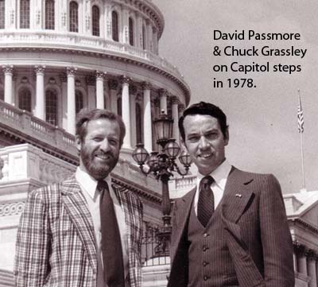

```{r setup, include=FALSE}
knitr::opts_chunk$set(echo = FALSE)
```


Back in 1978 -- when I worked for 10 months, two weeks, and 10 hours for the University of Northern Iowa -- I traveled to Washington about one day per week  to work with *YouthWork*, a private, intermediary firm between the U.S. Department of Labor and local governments with funds from the Comprehensive Employment and Training Act. Youthwork was headed by Corinne Reider, who eventually became Executive Director and Treasurer of the John Hartford Foundation, which is dedicated to improving health care for older Americans.

The University also asked me to meet with various politicians when I was in Washington. That is how I met then-Representative Chuck Grassley from Iowa, who is now United States Senator Chuck Grassley from Iowa.

Chuck Grassley now is the senior United States Senator from Iowa. He is a member of the Republican Party. During the last four decades in the Senate, Grassley has chaired the Senate Finance Committee, the Senate Narcotics Committee, the Senate Judiciary Committee, and the Senate Aging Committee. He is a graduate, with two degrees, from the University of Northern Iowa.

Chuck (yes, he prefers *Chuck*) took me to lunch at a restaurant in the Capitol Building. Its specialty is Capitol Hill Bean Soup, which I ordered and enjoyed. 

Before lunch even began, we launched into a debate about the role of dairy products in the Consumer Price Index, which was the subject of a New York Times front page article just several days before. To my great surprise, he was knowledgeable about the issue, understood the Consumer Price Index, and had a definite opinion that differed remarkably from mine about the relative weight of dairy products in the calculation of the Index. We debated for about ten minutes. 

He was testing me, I think. He warmed considerably after that debate, as we talked about his farm, our families, and Iowa. It was a great meeting, after which we had this picture taken on the Capitol Building steps:

{width=50%}

I know these "grip-and-grin" photos are stock items, but I did appreciate this momento of our meeting that this photo represents. We had a great time at the lunch so many years ago. I know, some of you might have issues with his voting record and politics, but I think he was honest and straightforward with his dealings. And, he usually choses his positions based on his personal convictions and beliefs -- and he rarely wavered. There is something admirable about that.

*Added now:*  **Yet, what a shock it was for me to see Chuck parrot the Trump Great Lie. Discouraging. Deflating. Impossible to view him as I did in 1978.** 


## Last updated on {.appendix}
```{r,echo=FALSE}
Sys.time()
```
## Reuse {.appendix}

Text and figures are licensed under Creative Commons Attribution [CC BY 4.0](https://creativecommons.org/licenses/by-sa/4.0/). Source code is available at https://github.com/davidpassmore/blog, unless otherwise noted. The figures that have been reused from other sources don't fall under this license and can be recognized by a note in their caption: "Figure from ...".

## Comments/Corrections {.appendix}

To make comments about this posting or to suggest changes or corrections, send email to [David Passmore](dlp@davidpassmore.net), send a direct message on Twitter @DLPPassmore, or send an IMsg or SMS to dlp@psu.edu.