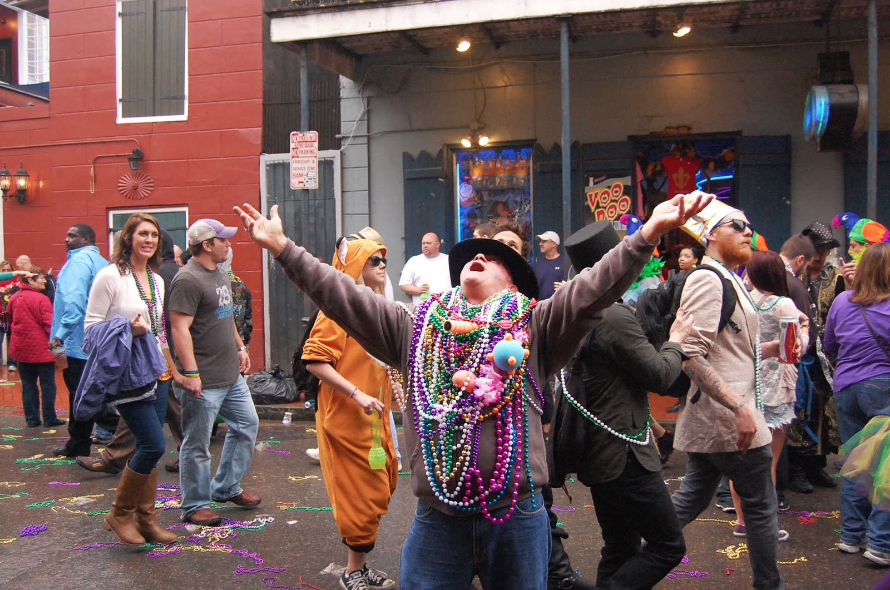
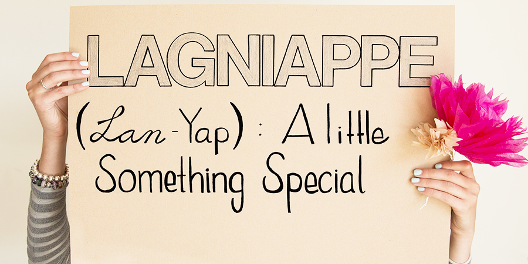
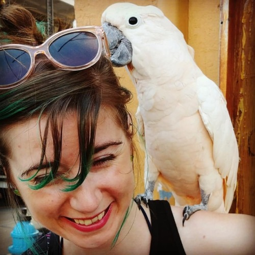
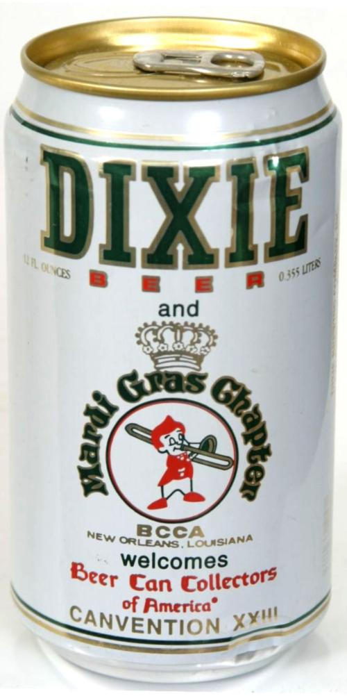
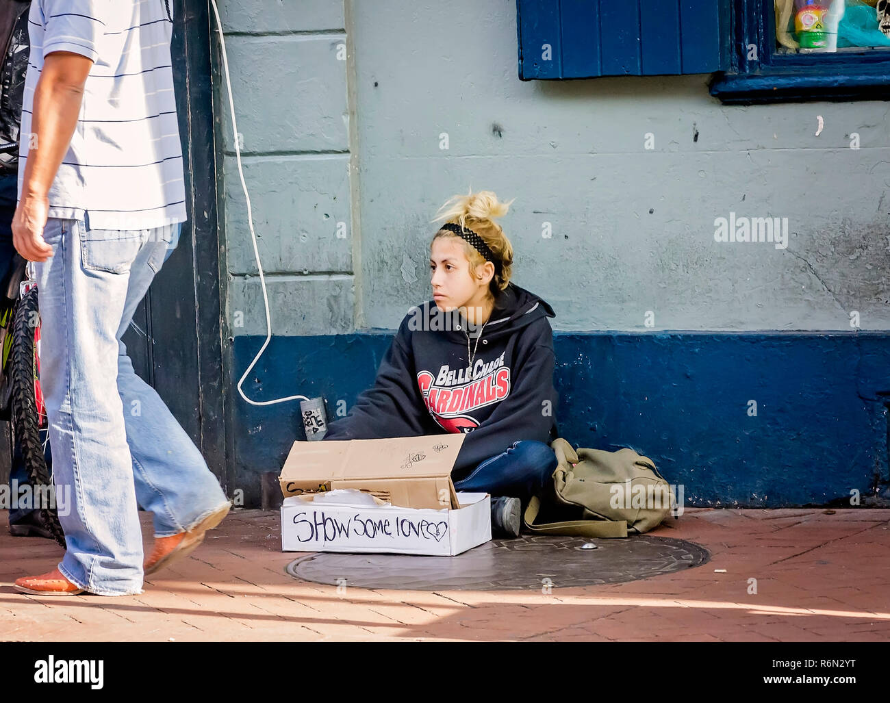
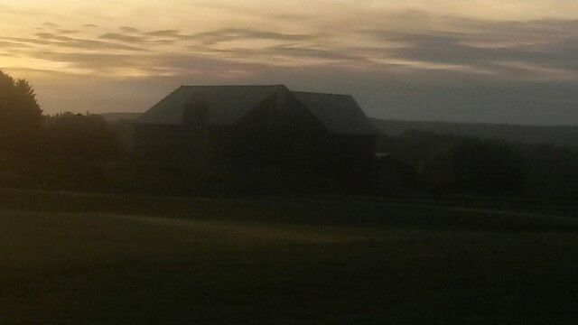

```{r setup, include=FALSE}
knitr::opts_chunk$set(echo = FALSE)
```

>My essay was published originally as "It’s a sad guess what happened to Big Easy’s street people."  in The Morning Call (Allentown, Pennsylvania, newspaper), September 7, 2005, p. A11.

The air is heavy and thick. A smell of moldy wood and decaying vegetation competes with the oily smoke given off by clams frying and the stale smell of beer dumped along the gutter.

Sweat flows over the hills and valleys of your body and soaks even your socks. In fact, it almost always feels like you are in a bath. Rain arrives almost daily, sometimes as a wild soaker, leaving puddles everywhere that the soon-to-follow burning sun cooks into a misty boil to poach, with indifference, sturdy natives, wigged transvestites, dyed streetwalkers, corner musicians, blue-jeaned rednecks, bar hucksters, street barkers, and visiting farmers from Nebraska.

This is New Orleans.

{width=100%}

I visit New Orleans frequently. Long ago I had my fill of the city's cheap, touristy side. As the years passed, however, I learned that the city always offers what the locals call *lagniappe*, a word with seemingly murky French/Spanish/Creole origins that means “a little something extra.” Like when you order a pound of ground beef, and the butcher adds a few ounces of beef for free just for you. Lagniappe breeds good will and friendship. It makes you want to come back.

A lesson for city gentrifiers and community developers everywhere: it's people -- not buildings, streets, or parking lots -- who pass out the lagniappe. It's not for sale. There are no tickets to lagniappe. You get it for free.

{width=50%}

I have discovered that New Orleans’ best distributors of lagniappe are its street people. Now, for sure, they panhandle. They could use a good hot bath. And, they display all the healing fractures, scars, leathered skin, missing teeth, and torn and second-hand clothing associated with hard lives on the streets. At times, they even appear a bit frightening. However, the street people are part of the vibrant and colorful, yet largely invisible, underbelly of New Orleans culture.

Maybe it's the heat and humidity. Maybe it's the South. Maybe it's the Big Easy, New Orleans, itself. But, street people in New Orleans put on a languid look and feel far beyond what cheap alcohol and drugs could ever create. They realize that “friendly” works better than “nasty” and that you might as well have fun while moving through a hard life.

During one pre-Katrina trip to New Orleans I strolled during the early evening down Bourbon Street. I passed the loud music bars with hurricane doors wide open, stopped to look at the man who will take your picture for $5 with his giant white parrot, and listened to the guy playing the saxophone off-key, but with great verve. Just then, someone called to me with the quintessential New Orleans greeting, “Hey, baybee, where y'at?”

{width=50%}

I turned to see two people, both white, by the corner of a building. She had long, somewhat gray, stringy hair, three missing teeth in front, and a brown, leathered face. She looked about 45, yet I found out later that she was 24. He had a pale pie face, head full of curly black hair, a scraggy beard, and pants cut off at mid-calf. He rested on a one crutch. They flashed great, mischievous smiles at me.

She said, “Baybee, you got fiddy cents for a coffee?” I just looked at them for about ten seconds. The guy started to laugh, “You see? He doan believe all dat tawk bout cawfee, eeder!” They both laughed. I moved over to meet them.

They realized that I wasn't going to give them money, so they just integrated me into their street operation. We talked while they hustled. 

“Hey, shoog, you gotta qwawdder?” “Maybe one a dem silvah dimes?” “Now, looka here, I am f'sure thirsty, baybee.” “You gonna spend dat money in you pawket somewhere nasty. Bring it heeyah, boo, where I can keep it for ya.” 

All with a laugh, a smile, and a sweet, friendly disposition. Most people donated nothing still walked away with a smile. And, on and on and on, until they gathered enough change to buy two cans of beer.

I walked with them to a moldy, ramshackle corner store. She told me, “I went to Catlick school, but, f'true, baybee, I went wrong. Beer, beer, beer! And, they say I got this HIV thing. I donnknow. They tell me I gonna be dead. Maybe I get a hawt attack r sump'in. So, let dem good times roll! I ain nevah gonna be no broad in house coat n' curlas makin' groceries over at the [Schwegmanns](https://en.wikipedia.org/wiki/Schwegmann_Brothers_Giant_Supermarkets).” She turned to the clerk, “Heya, I'll take me a Pabst Blue Ribbon, a Dixie, and two go-cups, podna.” They both laughed.

{width=15%}
“Let's go by our house,” she suggested. Their “house” was a clump of thick bushes over by the Mississippi River, which was surprisingly close to tourists walking along the river. She disappeared into the thicket. 

He told me, “Hey, cap, she gonna change, then, she wrench [*trans* — ‘to wash under running water’] her hands in the zink over by the Algiers ferry afta usin’ da public turlets.” She came out of the bushes, where they had a bed roll, and exclaimed zestfully, “Yeah, you rite!”

I spent a lot of time with them. Yet, it surprised me that they remembered me every time I traveled to New Orleans, no matter how much time passed between visits. 

“Hey, watchoodoon, baybee?,” she would yell when I would show up in town, as though I had just returned after brief visit to the grocery store. Nothing changed. I would always have extended, wonderful, and poetic conversations with them while I watched them ply their craft. 

There might have been a hundred people like those two on the streets of New Orleans before Hurricane Katrina. Poor, but real, people whose lives deviated into strange, dangerous areas. But, people whose spark of life made New Orleans the unique place it was. 

Where are these people now? And, where, oh where, is New Orleans?

{width=50%}

Early in the morning shortly post-Katrina I sat in a splendid green public park in State College, Pennsylvania, my home town.^[since moved to Pittsburgh] I watched a thin sliver of moon rise slowly above Mount Nittany. The back side of the moon glowed with reflected light from the Earth. The clear sky just was starting to blush with dawn’s soft light, although pimples of the brightest stars still showed through. 

All was quiet except for August's orchestra of crickets and tree frogs and the slow, dim doppler whine of trucks moving along a distant interstate highway.  Under this same sky, in New Orleans, so far away in miles and dreams from our serene Happy Valley, was birth, death, and all that flows in between. I saw visions of chaos. Fear. Tears. Murder. Burglary. Loss. Despair.

I can only wonder, “Hey, baybee, where y'at!?”

{width=100%}

## Last updated on {.appendix}
```{r,echo=FALSE}
Sys.time()
```
## Reuse {.appendix}

Text and figures are licensed under Creative Commons Attribution [CC BY 4.0](https://creativecommons.org/licenses/by-sa/4.0/). Source code is available at https://github.com/davidpassmore/blog, unless otherwise noted. The figures that have been reused from other sources don't fall under this license and can be recognized by a note in their caption: "Figure from ...".

## Comments/Corrections {.appendix}

To make comments about this posting or to suggest changes or corrections, send email to [David Passmore](dlp@davidpassmore.net), send a direct message on Twitter @DLPPassmore, or send an IMsg or SMS to dlp@psu.edu.
