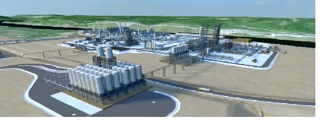

```{r setup, include=FALSE}
knitr::opts_chunk$set(echo = FALSE)
```

I have many questions about the ethane cracker and pellet manufacturing operation at the Pennsylvania Petrochemicals Complex in Monaca, Pennsylvania, for which I do not have answers. Maybe you have answers for me. I am ignorant. Educate me, please! Share information with me. Contact me with your answers or insights through a direct message on Twitter [\@DLPPassmore](https://twitter.com/dlppassmore) or via email at [dlp\@davidpassmore.net](mailto:dlp@davidpassmore.net){.email}.[^1]

[^1]: I hope to get a "Comments" section for this blog soon.

{width="75%"}

But, first, a brief background statement about my simple, personal understanding of ethane cracking and pellet manufacturing at the Pennsylvania Petrochemicals Complex, an understanding that I encourage you to dispute and suggest that I update. Then, I offer my questions. Bored with the background already? Then, jump directly to the questions.

### Brief Background

#### Natural Gas Liquids

Obtaining methane for energy production is a primary focus of natural gas extraction from Marcellus Shale and Utica shale formations in the northeastern U.S. Natural gas extracted in north central and northeast Pennsylvania is described as "dry" because it contains mostly methane. However. so-called "wet" gas produced in southwestern Pennsylvania also contains methane as well as natural gas liquids (NGLs) -- such as ethane, propane, butane, isobutane, and pentane. These co-products[^2] of natural gas production, while costly to separate from the natural gas stream, have commercial value, adding profitability to the extraction of wet gas.

[^2]: A *co-product*, a desirable secondary good that is generated during the manufacturing process and can be sold or reused profitably, is different than a *by-product*, a material of value that is produced as a residual of, or incidental to, the production process. In an accounting sense, co-products generate revenue; by-products are associated with costs.

#### Ethane Cracking

Historically, most NGLs used in the U.S. have been recovered from U.S. natural gas, although some have been sourced from crude oil refining and imports [@keller2012]. Ethane represents the highest proportion of NGLs in wet gas. Ethane distilled from natural gas liquids is a feedstock for ethylene production.

Ethylene is a raw material for the manufacture of polymers such as polyethylene, polyvinyl chloride, and polystyrene as well as fibers and other organic chemicals. A majority of ethylene is produced using a process called "steam cracking," a thermal process in which hydrocarbons[^3] are broken down, or "cracked" into smaller molecules.

[^3]: organic chemical compound composed exclusively of hydrogen and carbon atoms

Ethane, (C$_{2}$H$_{6}$), is a heavier hydrocarbon than methane (CH$_{4}$). Fundamentally,[^4] superheated, pressurized steam causes ethane to vaporize, which splits the bonds between carbon and hydrogen atoms. Ethyelene molecules (H$_{2}$C⚌CH$_{2}$), form, freeing two hydrogen atoms. The resulting vapor is composed of ethyelene, other hydrocarbons, unprocessed ethane molecules, and steam.[^5] The vapor undergoes additional processing to isolate ethylene molecules.

[^4]: and skipping many steps in the chemical engineering of ethylene production from ethane

[^5]: Figure from <https://insights.globalspec.com/article/1490/natural-gas-for-export-process-fundamentals-for-engineers-part-1>

{.external width="50%"}

#### Polymerization

Unique among elements is the capability of carbon to form single bonds chemically with up to four other atoms and to double bond with itself, as in an ethylene molecule. Carbon is one of the only elements, because of its bonding properties, that can create long chain-shaped molecules to form the basis for the fats, carbohydrates, nucleic acids (DNA and RNA), and proteins that serve as the basis of life itself. Chaining together ethylene molecules (monomers) through a chemical process called polymerization produces polyethylene (a polymer, which means "many parts") with thermoplastic attributes. A thermoplastic has the property of softening or fusing when heated and of hardening and becoming rigid again when cooled.

#### Downstream Uses of Polyethylene

Polyethylene is the primary feedstock for manufacturing a vast range of consumer products, the foremost of which involve packaging (a few of many examples: sandwich wrap, cling wrap, moisture barriers, food packaging, box coating). Polyethylene often is produced as small pellets. These plastic pellets are unit-priced by the pound for sale in downstream markets. Pellet prices demonstrate volatility [@pederson2021] because they are driven on the supply side by equally volatile prices for natural gas and on the demand side by consumer preferences for "eco-friendly" packaging solutions and by environmental regulation of plastic products.

#### Notable Inputs & By-Products of Ethane Cracking

*Some Inputs*

An ethane cracker gathers, usually through pipelines, a supply of ethane feedstock that has been fractionated [@fraction][^6] from the NGL spectrum in natural gas extracted from shale formations at well sites. Markedly, ethylene production uses a large amount of energy to superheat steam to crack ethylene from ethane.

[^6]: Chemical separation by successive operations, each removing from a liquid some proportion of one of the substances. The operation may be one of precipitation, or more familiarly of distillation.

*Some By-Products*

Cracking ethane emits hazardous by-products[^7] that can render the air, soil, water, or other natural resources harmful or unsuitable for use. Small inhalable particles (e.g., PM$_{2.5}$) are another by-product of ethane production that can damage short- and long-term human respiratory function. Cracking also releases carbon dioxide (CO$_{2}$), a gas that can absorb energy within the infrared wavelengths and transfer this energy to other molecules by colliding with them. Faster molecular motion produces heat. Trapped heat from this action of carbon dioxide in the Earth's atmosphere is the "greenhouse effect" that has affected in global warming.

[^7]: Again, a by-product differs from a co-product. A co-products generates revenue; a by-product is associated with costs.

#### The Pennsylvania Petrochemical Complex

Shell[^8] made a final investment decision to build an ethane cracker integrated with a plastic pellet manufacturing facility at the Pennsylvania Petrochemicals Complex on the Ohio River in Monaca, Pennsylvania [@pennsylv]. The plant is nearing is nearing completion and could starting operating in late 2022, according to Shell announcements reported in the popular press [@melinek2021].[^9] Shell has estimated variously the deployment of between 400 to 600 jobs at the Complex.

[^8]: a public liability company incorporated in the UK

[^9]: Figure from *Google Maps* image

{width="100%"}

Shell has indicated that the plant will produce 1.6 million tons of various grades of polyethylene pellets from 3.9 million barrels of ethane annually. The ethane cracker is geographically proximal to ethane sources in Pennsylvania, Ohio, and West Virginia involved with wet gas production and processing from Marcellus and Utica shale formations.[^10] More than 70% of North American polyethylene customers are within a 700-mile radius of plastic pellet production at the Pennsylvania Petrochemical Complex.

[^10]: According to leaders of coalitions of natural gas producers in Pennsylvania, West Virginia, and Ohio, "Our three states produce roughly one-third of America's natural gas, making Appalachia the third largest gas producer in the world --- behind only the U.S. itself and Russia" [@callahan2022].

According to a biting 2020 analysis offered by the [Institute for Energy Economics and Financial Analysis](https://ieefa.org/) [@sanzillo2020], the Pennsylvania Petrochemical Complex faces prospects of low product prices, risk of oversupply of plastic resins, stiff competition from other producers, volatility in ethane feedstock markets, the possibility of low overall economic growth, and competition from recycled plastics materials. Concluded by the Institute is that the Complex "will open to market conditions that are more challenging than when the project was planned. The [C]omplex is likely to be less profitable than expected and face an extended period of financial distress."

### Some of My Questions....You Have Answers?

#### What Motivates My Questions?

As I wrote, I have many questions about the Pennsylvania Petrochemicals Complex. In particular, I am largely ignorant of many of the fundamental facts about the Complex. Perhaps, you feel that way, too.

I believe I have answers to some questions, which I will share for your scrutiny. Many of my questions have extant answers, of course. I just have not discovered them. You can help by informing me about accessible documents that provide answers. And, perhaps you have new and important questions that I have not considered. Poke them into the stream of thought in this blog about the Pennsylvania Petrochemicals Complex.

#### What Qualifies as Answers?

I seek answers that possess the following attributes:

1.  *General answers are not helpful* about ethane cracking, natural gas production, or the plastics industry. Rather, the Pennsylvania Petrochemicals Complex remains the focus of all answers.\
2.  *Primary sources* are desired, not secondary reports. Often-cited and -repeated story lines about energy topics can originate in social media postings, manifestos from opposing or supporting advocacy groups, releases from public relations groups representing clients, or public statements from energy-using or -producing firms themselves. These secondary sources of fact, intention, or opinion -- sometimes abstracted from primary sources -- might be wholly or partially true and factually certain. Yet, a careful examiner desires more primary direct, accountable information. For instance, citation of a press release about the amount of CO$_{2}$ a facility will emit is less desirable information than an official, legal filing with regulatory authorities about the amount and kind of pollutants a facility promises to emit. Unfortunately, however, secondary sources might contain the *only* hints available about operational and financial details and intentions. Non-disclosure and translucence in secondary sources about such matters as technology and intention, in fact, can support strategy of actors representing specific interests.\
3.  *Open access and transparency* about answers are necessary. For example, a publicly-accessible summary of an otherwise inaccessible[^11] report is nothing more than information that remains inaccessible for critical review. Also, information that is not accessible and about which details are hidden, selectively screened, or incompetently reported mean that information is unverifiable. It plainly is hearsay. As Stevie Wonder once sang in his 1972 composition [*Superstition*](https://youtu.be/ftdZ363R9kQ), "When you believe in things that you don't understand, then you suffer."

[^11]: i.e, behind a pay wall or restricted to limited distribution among advocates.

*In sum, then: I wish to study documentable, accessible, clear answers to questions about the Pennsylvania Petrochemical Complex.*

#### But, Wait, What Are My Questions?

Some answers to these questions are available to me already. Others are not. Some answers are buried in dry regulatory or technical reports. No evidence is available to answer others now and, perhaps, in the future.

I will refine or extend this list of questions as I learn more about the Pennsylvania Petrochemicals Complex:

1.  Inputs to the complex\

-   1.1 What goods and services does the plant purchase?\
    -   1.1.1 from the region?\
    -   1.1.2 from outside the region?\
    -   1.1.3 With what costs?
    -   1.1.4 from what suppliers?
-   1.2 What is the laborshed[^12] for the plant?\
-   1.3 How many workers are employed at the plant?\
    -   1.3.1 In what occupations?
    -   1.3.2 For what pay?
    -   1.3.3 By place of residence?
    -   1.3.4 By licenses/credentials?

[^12]: The area or region from which the plant draws its workers.

2.  Outputs from the complex

-   2.1 What are the products and co-products of the plant?
    -   2.1.1 to the region?
    -   2.1.2 outside the region
    -   2.1.3 at what prices?
    -   2.1.4 to what customers?
-   2.2 What are the by-products of the plant?
    -   2.2.1 in what form produced?
    -   2.2.2 to whom and where delivered?
    -   2.2.4 at what costs?

3.  Performance of the complex

-   3.1 How is the activity, output, and performance of the plant classified in national/regional income and product accounting systems?
-   3.2 What are the direct, indirect, and induced effects (current, not forecasted) of plant operation on employment, income, and taxes in regional, state, and national economies (an input-output framework implied; see [@passmore2022])?
-   3.3 What are the community trends in social and economic indicators over the period of plant operation?
    -   3.3.1 compared to the U.S.

    -   3.3.2 compared to Pennsylvania

    -   3.3.3 compared to similar communities operating without ethane cracking and pellet manufacturing (implies a quasi-experimental research design; see [@shadish2001])
-   3.4 What is the contribution of the plant to the financial returns to its owners (as shown in ad hoc and periodic reports to shareholders and other stakeholders)?
-   3.5 In what regulatory/enforcement actions has the plant been involved?

#### And, Where Are Answers Documented?

I request that you share information with me about these and other useful questions or provide answers to questions. Contact me with your insights through a direct message on Twitter [\@DLPPassmore](https://twitter.com/dlppassmore) or via email at [dlp\@davidpassmore.net](mailto:dlp@davidpassmore.net){.email}. Yes, you will be credited for your contribution.

In the next week (today is 21 April), I will open a posting in this blog site (served at `davidpassmore.github.io/blog`) that will contain questions asked and answers assembled. I will update this paragraph to display the URL of the blog posting when it becomes available. Updates of the "Q & A" blog posting with questions and answers will occur as questions are refined or extended and when additional answers are provided. The blog posting will offer an RSS feed and a subscription link to allow notification about changes that occur in the posting.

```{r,echo=FALSE}
Sys.time()
```

## Reuse {.appendix}

Text and figures are licensed under Creative Commons Attribution [CC BY 4.0](https://creativecommons.org/licenses/by-sa/4.0/). Source code is available at <https://github.com/davidpassmore/blog>, unless otherwise noted. The figures that have been reused from other sources do not fall under this license and are recognized by footnoted text: "Figure from ...".

## Comments/Corrections {.appendix}

To make comments about this posting or to suggest changes or corrections, send email to [David Passmore](mailto:dlp@davidpassmore.net), send a direct message on Twitter at [\@DLPPassmore](https://twitter.com/dlppassmore), or send an IMsg or SMS to [dlp\@psu.edu](mailto:dlp@psu.edu){.email}.
